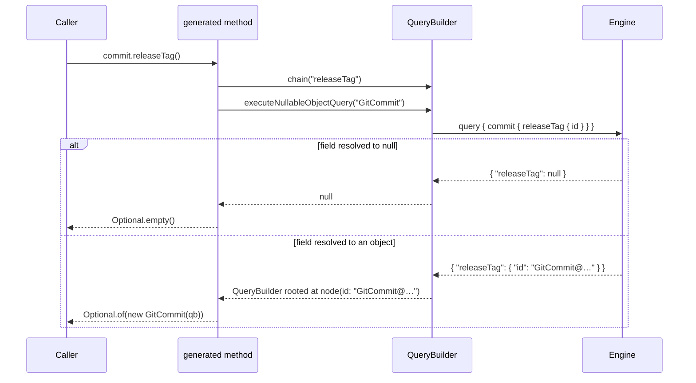

# Nullable object returns for the Java SDK

Status: proposed
Date: 2026-08-17

> One decision below was later reversed. This document rejects making the query
> transport public API because it would be permanent surface added for one test.
> `hack/designs/done/2026-09-13-unified-client-generation.md` makes it public for a
> different reason: generated code now lives outside `io.dagger.client` and has
> to be able to build a query.

## Problem

GraphQL fields that return a nullable object or interface (`field: Directory`, not
`field: Directory!`) have no correct representation in the generated Java client.
Today `ObjectVisitor`/`InterfaceVisitor` treat every object-typed field the same
way, nullable or not: the method is *lazy* — it appends the field to the query
chain and immediately wraps the resulting `QueryBuilder` in a client object,
without ever talking to the engine.

```java
public Directory child() {
  QueryBuilder nextQueryBuilder = this.queryBuilder.chain("child");
  return new Directory(nextQueryBuilder);  // never null, even when the field is
}
```

For a nullable field that is wrong in a way the caller cannot recover from: the
returned object looks valid, and the null only surfaces later as a confusing
failure deep inside an unrelated query. This is not a hypothetical corner —
the core schema has 28 such fields, including the whole `TypeDef.as*` family
(see Risks).

The module-authoring side is worse: a module function declared as
`Optional<Directory>` does not merely misbehave, it **does not build**.
`DaggerType.of` unwraps `Optional<…>` and throws the optionality away
(`DaggerType.java:63`), so the generated entrypoint emits
`io.dagger.client.Directory res = obj.maybeDirectory(found);`
(`DaggerModuleAnnotationProcessor.java:608,679`) — a javac error. There is no
working behaviour to preserve on that side; the change is purely additive.

Upstream fixed this across all SDKs in
[dagger/dagger#13879](https://github.com/dagger/dagger/pull/13879). Java's share
of that PR targets `dagger/dagger`'s in-tree `sdk/java`, which this repository
superseded. This document is the same feature, landed here.

## Goals

- Generated client: a nullable object/interface field returns `Optional<T>`,
  resolved eagerly.
- Generated client: a **non-null** object/interface field keeps today's lazy
  behaviour, byte-for-byte.
- Module authors: `Optional<T>` as a function return type registers an optional
  object return and round-trips `null` correctly.
- The generated shape is gated on the engine's schema version so the SDK keeps
  working against engines older than `v1.0.0-beta.10`.
- Produce the behaviour `dagger/dagger`'s own integration suite asserts of a
  compliant Java SDK (`JavaSuite.TestOptionalReturn` and the
  `testdata/modules/java/defaults` fixture). Those two files live in
  `dagger/dagger`, not here; landing them is a companion change in that
  repository and is out of scope for this branch.

## Non-goals

- Nullable *scalar* returns. Already representable (`TypeRef.formatType` boxes
  `Boolean`/`Int`/`String` unconditionally, so a null scalar is a Java `null`,
  not an unboxing NPE); unchanged.
- Nullable **list elements** (`[Directory]`) or nullable lists. Out of scope
  upstream too, and the core schema currently has no list-of-nullable-object
  field. `QueryBuilder.executeObjectListQuery` (`QueryBuilder.java:253`) would
  need its own design.
- Nullable object *arguments*. `Optional<T>` arguments already work end to end
  (see Risks — the processor unwraps them before `DaggerType` ever sees them).
- Changing any non-null method's signature or laziness.
- A general `Nullable`/`Maybe` type. `java.util.Optional` is the idiom the
  cross-SDK table names for Java.

## Approach

### Client side: resolve the ID, then rebuild lazily

A nullable object method stops being lazy. It chains the field, asks the engine
for that object's `id`, and then either returns `Optional.empty()` (the field
resolved to `null`) or rebuilds a *normal, lazy* client object rooted at
`node(id:)`. Everything downstream of that point is lazy again — only one extra
round trip is introduced, at exactly the point where the caller has to make a
decision anyway.



Generated shape:

```java
public Optional<Directory> child()
    throws InterruptedException, ExecutionException, DaggerQueryException {
  QueryBuilder nextQueryBuilder = this.queryBuilder.chain("child");
  QueryBuilder objectQueryBuilder = nextQueryBuilder.executeNullableObjectQuery("Directory");
  return Optional.ofNullable(objectQueryBuilder).map(qb -> new Directory(qb));
}
```

Because the method now performs a query it must declare the SDK's three checked
exceptions — the same ones every scalar and list method already declares.

Interfaces get one extra wrinkle. In an interface *declaration* the return type
is widened to `Optional<? extends Directory>` so an implementing object can
narrow it: `ObjectVisitor` emits `implements <Iface>` (`ObjectVisitor.java:36`),
and a `Kennel` returning `Optional<Dog>` only overrides a declaration typed
`Optional<? extends Animal>`. This is upstream's design, correctly scoped to
`TypeKind.INTERFACE` fields, and is covered by a compile test.

`QueryBuilder` gains one package-private method:

```java
QueryBuilder executeNullableObjectQuery(String graphqlTypeName)
    throws ExecutionException, InterruptedException, DaggerQueryException {
  String id = chain("id").executeQuery(String.class);
  if (id == null) {
    return null;
  }
  return new QueryBuilder(this.client).chainNode(graphqlTypeName, id);
}
```

This composes from primitives this repository's diverged `QueryBuilder` already
has, and the composition was traced end to end during plan review:

- `chain("id")` pushes a real `QueryPart`. It must be `chain(String)`, **not**
  `chain(List.of("id"))` — the latter records a *leaf*, and leaves are invisible
  to the response path walk in `executeQuery(Class)`. (The list codegen path at
  `ObjectVisitor.java:270` legitimately uses the leaf form; this one must not.)
- `buildQuery` (`QueryBuilder.java:136-149`) renders `query {child {id}}`, and
  when the receiver is itself node-rooted it renders
  `node(id:"…"){... on T {child {id}}}` — the inline fragment is applied at the
  outermost part only, which is correct here.
- `executeQuery(Class)` walks `parts.descendingIterator()` and is null-safe at
  every hop (`QueryBuilder.java:182-184`), so a JSON-`null` field yields Java
  `null`. Unlike upstream's JsonPath-based version, this needs no extra guard.

### Module side: `Optional<T>` is a first-class `DaggerType`

`DaggerType.of` stops discarding `Optional<…>` and instead returns a
`DaggerType.Optional` decorator around the inner type. It contributes
`.withOptional(true)` to the registered `TypeDef` and keeps `Optional<Inner>` as
the Java type. A new `valueForSerialization(String)` hook (identity for every
other `DaggerType`) makes the generated invoker serialize `res.orElse(null)`
instead of the `Optional` wrapper, so an empty `Optional` reaches the engine as
JSON `null`. `JsonConverter.toJSON(null)` is an already-exercised path — the
void return uses it (`DaggerModuleAnnotationProcessor.java:695`).

### Version gating, and the property that makes it real

Upstream gates the new shape on the schema version: below `v1.0.0-beta.10` the
old lazy shape is kept. `Schema` here already carries a `version` string, so the
gate ports directly as `Schema.supportsNullableObjects()` (unparseable or absent
versions — dev builds — are treated as new).

But the gate would be **inert and permanently false** in this repository. The
codegen mojo's `dagger.version` parameter (`DaggerCodegenMojo.java:38`) is only
overwritten with the live CLI version inside `daggerSchema()`
(`DaggerCodegenMojo.java:131`), the fallback taken when no schema file is
supplied. On the path this repository actually uses, `mod.dang:143` passes
`-Ddaggerengine.schema=/schema.json`, the mojo returns early
(`DaggerCodegenMojo.java:119`), and `version` stays whatever the pom says — the
hardcoded `<daggerengine.version>0.21.4</daggerengine.version>`
(`sdk/pom.xml:211`).

So the gate comes with its plumbing fix: `mod.dang` threads an
`engineVersion: String!` through `sdkBuilt`/`vendoredSdk`/`vendoredSdkJar` and
passes `-Ddaggerengine.version=<engine version>` alongside the schema it already
passes. Three candidate sources were measured against a live engine during plan
review:

| source | value | verdict |
| --- | --- | --- |
| root `version` | `v1.0.0-beta.9+1c6e07b1` | **correct** — the live engine, same thing `dagger version` reports on the fallback path |
| `ModuleSource.engineVersion` | `v1.0.0-0` (this module), `v1.0.0-beta.7` (a fixture) | wrong — the module's *declared compatibility* version from `dagger-module.toml`, not the engine |
| `__schemaVersion` (already in the introspection query) | `v1.0.0` | wrong — a coarse API-compat version; it cannot express a beta.10 boundary |

The dang expression is therefore the root `version` field, reachable exactly like
the existing root `container`/`directory`/`currentModule`. Build metadata is
stripped (`version.split("+")` first element) before it is passed: the `+<commit>`
suffix changes on every engine build and would otherwise become a Dagger cache
key that invalidates every module's `sdkBuilt` on each engine rebuild.

The pom default is deliberately **not** changed. It is only consulted when a
caller supplies a schema without a version; every other path (a plain
`mvn install`, which falls through to the CLI) already resolves the real
version, and `mod.dang` will now always pass one.

**Consequence worth stating plainly:** the local engine and CLI are
`v1.0.0-beta.9+1c6e07b1`, below the gate. Until the engine reaches beta.10 the
generated client keeps the old lazy shape, and the repository's generation
checks therefore do **not** exercise the new client codegen. Unit tests
covering both sides of the gate are the only in-repo coverage of the new shape,
which is why wiring tests into CI (below) is part of this change rather than a
nicety.

## Alternatives considered

**Return `T` and let it be `null`.** Rejected: it is the failure mode we are
fixing, silently. `Optional` is also what the cross-SDK table names for Java.

**Keep nullable methods lazy and add a separate `Optional<T> xOrEmpty()`.**
Rejected: doubles the API surface, and the laziness is precisely what cannot be
preserved — you cannot know whether the field is null without asking.

**Drop the version gate entirely.** Tempting: this repository declares
`engineVersion = "v1.0.0-0"` everywhere, and it already requires unified IDs and
`node(id:)` (`QueryBuilder.chainNode`), so the gate's real coverage is the narrow
band `[1.0.0-beta.0, 1.0.0-beta.10)` rather than "old engines" in general.
Rejected anyway: it is ~15 lines, it keeps this a faithful port of what every
other SDK does, and it is cheap to delete later. The honest justification is
cross-SDK consistency, not old-engine support.

**Bump `daggerengine.version` to a 1.0 literal instead of plumbing the real
version.** Rejected: trades one stale literal for another, and leaves the
generated `Version.VERSION` lying.

**A `GraphQLTransport` interface as a test seam over the `final class
GraphQLClient`.** Rejected after review. It would have to be `public` (the two
classes are in different packages), i.e. new permanent public API for one test;
and the fake could not be built anyway, since `GraphQLResponse.fromBody` is
package-private in `io.dagger.client.graphql` (`GraphQLResponse.java:23`) and the
test lives in `io.dagger.client`. Instead the tests point a **real**
`GraphQLClient` at a `com.sun.net.httpserver.HttpServer` bound to `127.0.0.1:0`
returning canned JSON. Zero production change, no new dependency, and it covers
request formatting and response parsing too.

**`mockito`.** Rejected: `GraphQLClient` is final, so it needs the inline mock
maker, and the HttpServer approach is both cheaper and more faithful.

## Affected components

| Component | Change |
| --- | --- |
| `sdk/dagger-codegen-maven-plugin` · `Schema` | `supportsNullableObjects()` version gate |
| `sdk/dagger-codegen-maven-plugin` · `ObjectVisitor`, `InterfaceVisitor` | `Optional<T>` return type + resolved body for nullable object/interface fields |
| `sdk/dagger-java-sdk` · `QueryBuilder` | `executeNullableObjectQuery` |
| `sdk/dagger-java-annotation-processor` · `DaggerType` | `DaggerType.Optional` + `valueForSerialization` |
| `sdk/dagger-java-annotation-processor` · `DaggerModuleAnnotationProcessor` | serialize via `valueForSerialization` |
| `sdk/pom.xml`, module poms | a `tests` Maven **profile** carrying junit-jupiter, assertj and surefire |
| `.dagger/modules/e2e` | a `@check` that runs the unit tests; a nullable-return fixture check |
| `mod.dang` | thread the engine version, pass `-Ddaggerengine.version` |

## Testing

The repository currently has **no** `src/test` anywhere and no test-scope
dependencies. That is deliberate: commit `1cc5baf` ("java-sdk: drop test
dependencies from the vendored SDK reactor") removed them precisely because
*Maven resolves test-scoped dependencies even under `-Dmaven.test.skip=true`*,
so every cold `dagger generate` was downloading several MB it could never use.
Both generation paths still use that flag (`mod.dang:124`, `mod.dang:143`,
`.dagger/modules/packager/main.dang:36`).

So test capability comes back **behind a Maven profile**, not unconditionally:

- A `tests` profile in `sdk/pom.xml` (and the three child poms) supplies
  junit-jupiter, assertj-core and a pinned Surefire. AssertJ is kept — one jar,
  no transitive dependencies — because it makes the generated-source assertions
  readable and lets the upstream test bodies port with minimal edits.
- No profile activation, no resolution: `dagger generate` and `packager` resolve
  exactly what they resolve today, and `1cc5baf`'s optimisation is preserved.
  Two caveats found in review, both handled in patch 2: adding profiles edits
  the poms that `packager` *installs*, so the committed `prebuilt/m2` must be
  regenerated in the same patch; and `dependency:list` alone cannot prove the
  no-profile path is unchanged (it ignores plugin resolution, and a warm `~/.m2`
  hides downloads), so the comparison is run against a **fresh empty local
  repository** on both sides.

And tests must actually **run**. CI here is Dagger Cloud checks driven by
`dagger.toml` (`e-2-e:*`, `packager:generate`, `sdk-sdk:*`, `load`,
`dagger-dang-sdk:generate`); there are no GitHub Actions build workflows, and no
existing check runs `mvn test`.

The naive `mvn -Ptests test` over `sdk/` does **not** work, and both reviewers
caught it independently: `dagger-java-sdk`'s pom binds the codegen mojo at
generate-sources (`sdk/dagger-java-sdk/pom.xml:78-90`). With no
`-Ddaggerengine.schema` the mojo takes the CLI fallback and shells out to
`dagger`, which the pinned maven image does not contain; and the codegen plugin
must already be *installed*, which is exactly why `mod.dang`'s `codegenBase`
does a separate `--projects dagger-codegen-maven-plugin install` exec first.

So the check lives on **`packager`**, which already owns the pinned maven image,
the shared `~/.m2` cache volume and `sdkSource(ws)`, and already knows how to
install the plugin. It mirrors `codegenBase`/`sdkBuilt`:

```
unitTests(ws: Workspace!): Void @check {
  mvn.withoutEntrypoint
    .withMountedCache("/root/.m2", cacheVolume("sdk-java-maven-m2"))
    .withMountedFile("/schema.json", introspectionJSON)
    .withDirectory("/dagger-io", sdkSource(ws))
    .withWorkdir("/dagger-io")
    .withExec([… "--projects", "dagger-codegen-maven-plugin", "--also-make", "install", …])
    .withExec(["mvn", "-Ptests", "test",
               "-Ddaggerengine.schema=/schema.json",
               "-Ddaggerengine.version=" + engineVersion,
               "-Dfmt.skip=true", "--no-transfer-progress"])
    .sync
  null
}
```

`packager` has no way to reach an introspection JSON today — `mod.dang` gets it
from `polyfill.workspace(ws).moduleSource(…).core.introspectionSchemaJSON`. The
exact expression is resolved against a live engine during patch 2, adding the
`polyfill` dependency to `packager` if that is what it takes; if `packager`
cannot reach one at all, the check moves to `e2e`, which already depends on
`java-sdk` and takes a `Workspace!`. Passing `-Ddaggerengine.version` here also
means the unit-test run exercises the same gate value CI generation uses.

Without this check, the profile and the four test classes would buy nothing.

Coverage, mirroring the dual (present / null) cases upstream covers:

1. **Version gate** — boundaries and dev versions (`v1.0.0-beta.9` false,
   `v1.0.0-beta.10` true, `-dev` and `+<commit>` suffixes, unparseable, empty).
2. **Codegen shape** — below the gate a nullable object field still generates
   `Directory child();` with no exceptions; at/above it generates
   `Optional<Directory> child()` with `DaggerQueryException`.
3. **Codegen compiles** — the covariant interface/object pair
   (`Owner.pet(): Optional<? extends Animal>` / `Kennel.pet(): Optional<Dog>`)
   compiled in-process via `ToolProvider.getSystemJavaCompiler()`. The
   *mixed*-nullability pair (interface field nullable, implementing object's
   field non-null) is added to this test as well — see Risks.
4. **`QueryBuilder`** — against a local `HttpServer`: present case, a response
   carrying an `id` produces a builder rooted at `node(id:"…"){... on T {…}}`;
   null case, a response whose field is JSON `null` produces `null`. The
   captured request body is asserted too.
5. **`DaggerType`** — `Optional<Container>` renders
   `…withObject("Container").withOptional(true)`, keeps `Optional<…>` as its
   Java type, and serializes as `res.orElse(null)`. Plus a case pinning that
   `Optional<String>` *arguments* are unchanged, and one for the newly-optional
   `Optional<X>` object **field** registration.
6. **End to end** — an e2e fixture module declaring
   `Optional<Directory> maybeDirectory(boolean found)`, generated through the
   real `generateAll` path. This gives two things for free: the generated
   entrypoint must **compile** (`mod.dang`'s `generatedEntrypoint` runs maven
   with `dagger.proc=full`), which is exactly the failure described in Problem;
   and its registered return type must carry `.withOptional(true)`.

**What in-repo tests deliberately do not cover:** the live null round trip that
`JavaSuite.TestOptionalReturn` asserts
(`{missing: maybeDirectory(found:false), found: maybeDirectory(found:true)}` →
`{"missing": null, "found": {…}}`). Loading and *calling* a fixture module from
inside a check is not reachable here — `asModuleSource` needs a requester
session, which is why module-source handling still goes through the polyfill
(`main.dang:114`). That assertion lives in `dagger/dagger`'s suite against a real
engine, and coverage items 5 and 6 pin the two halves of it (the serialization
primitive, and the registration + compilation) from this side.

## Risks

- **Signature change across 28 core fields.** Every nullable object/interface
  field in the core schema changes shape at/after beta.10. Counted from
  `core/schema/base_schema.json`: `TypeDef.{asObject,asInterface,asEnum,asList,asScalar,asInput}`,
  `Module.{source,runtime,sdk}`, `ModuleSource.sdk`,
  `Container.{dockerHealthcheck,stat}`, `Directory.stat`, `File.stat`,
  `Query.{node,loadStatFromID,loadSDKConfigFromID}`, `Check.error`,
  `LLM.bindResult`, `Binding.asStat`, `ObjectTypeDef.constructor`, and
  `sourceMap` on seven types. The `TypeDef.as*` kind-switch idiom is *correctly*
  used today by anyone introspecting a module — `typeDef.asObject().name()`
  becomes `typeDef.asObject().orElseThrow().name()`, gains three checked
  exceptions, and costs one round trip per `as*`. This is the upstream feature
  working as designed and every SDK takes the same hit, but it is a real
  migration for downstream callers, not a free change. Nothing in this
  repository's own Java (`sdk/`, `templates/`, `helpers/`) calls any of the 28,
  so this tree does not break.
- **Interface/object nullability mismatch.** If an object implements an
  interface whose same-named field is nullable while the object's own field is
  non-null, `InterfaceVisitor` emits `Optional<? extends Animal> pet()` and
  `ObjectVisitor` emits the lazy `Dog pet()` — which does not compile against
  the `implements` clause. Upstream shares this hole; its compile test only
  covers the both-nullable pair. Mitigation: add the mixed pair to the compile
  test (coverage item 3). If it reproduces, coerce the `Optional` shape in
  `ObjectVisitor` when an implemented interface declares the field optional.
  *Whether dagger's schema can actually emit such a pair is unverified* — the
  test is what settles it.
- **`Optional<X>` object fields become optional typedefs.** `FieldInfo` keeps
  the raw declared type (`DaggerModuleAnnotationProcessor.java:213`), so unlike
  parameters, a public `Optional<X>` field on a module object starts registering
  `.withOptional(true)` (`:408`). This is a correctness improvement rather than
  a regression, but it is a behaviour change the upstream PR does not call out.
  Accepted deliberately, pinned by a test.
- **Optional *arguments* are safe — this is not the risk it looks like.**
  `DaggerType.of` now wraps rather than unwraps, and it is used for parameters
  too, but parameters never reach it wrapped: the processor strips `Optional<…>`
  and records `isOptional` before building `ParameterInfo`
  (`DaggerModuleAnnotationProcessor.java:296-303`, `:354`), appends
  `.withOptional(true)` separately (`:730`), and re-wraps with
  `Optional.ofNullable` at invocation (`:625`, `:657`, `:681`). `@Default` is
  processed after unwrapping (`:306`, `:745`) and is untouched. Pinned by a test
  rather than by hope.
- **Extra round trip.** Each nullable object access costs one query. Inherent to
  the semantics; non-null paths are unaffected.
- **`-Ddaggerengine.version` changes a Dagger cache key.** The maven command in
  `sdkBuilt` now varies with the engine version, so every module's SDK build
  re-runs when the engine changes. Build metadata is stripped to keep that to
  real version changes rather than every engine rebuild.
- **`Version.VERSION` churn.** The plumbing changes the literal baked into
  generated `io.dagger.client.Version`. No generated client sources are
  committed in this tree, so no diff churn here; downstream modules will see it
  on regeneration. Note the constant has zero readers repo-wide, so "truthful
  `Version.VERSION`" is a side benefit, not a justification.

---

# Implementation plan

Patches are a StGit series on `java-sdk-nullable-objects-lead-4d7cf00b`, each
signed off, each building and testing green on its own. `packager:generate` is
the one exception: it compares against the committed `prebuilt/m2`, which is
refreshed when its inputs finish changing rather than in every patch that
touches them, so it reports drift at the one patch in between. Ordering note:
the `QueryBuilder`
method lands **before** the codegen that emits calls to it, so no patch leaves
the tree able to generate uncompilable code.

### Patch 1 — `hack/designs`: this document

### Patch 2 — test capability, wired into CI

- `sdk/pom.xml`: a `tests` profile with `junit-jupiter`, `assertj-core` and a
  pinned `maven-surefire-plugin`; version properties alongside the existing
  ones. Nothing outside the profile.
- The three child poms: the same profile adding the two test-scope deps.
- `.dagger/modules/packager/main.dang`: `unitTests(ws: Workspace!): Void @check`
  as sketched in Testing — plugin install, then `mvn -Ptests test` with the
  schema and version supplied.
- `prebuilt/m2`: regenerated (`dagger generate packager`), because the poms it
  contains now carry the profile.
- Verify: `dagger check` lists the new check and it goes green; the no-profile
  dependency set is unchanged, compared with a fresh empty local repository on
  both `main` and this patch (not just `dependency:list` against a warm `~/.m2`).

### Patch 3 — `Schema.supportsNullableObjects()` + gate test

- `Schema`: the `1.0.0-beta.10` constant and the predicate, using
  `ComparableVersion` from `org.apache.maven:maven-artifact` (add it explicitly
  at `provided` scope if it is not already resolvable through
  `maven-plugin-api`).
- `SchemaTest`: coverage item 1, including a `+<commit>` build-metadata case
  since that is what the live engine actually reports.

### Patch 4 — `QueryBuilder.executeNullableObjectQuery` + test

- The method as shown in Approach. No seam, no production API change.
- `QueryBuilderTest`: coverage item 4, against `HttpServer` on `127.0.0.1:0`.

### Patch 5 — client codegen

- `ObjectVisitor.buildFieldMethod` and `InterfaceVisitor.buildFieldMethod` /
  `generateType`: wrap the return type in `Optional<…>` (plus `? extends` on
  interface *declarations*), emit the `executeNullableObjectQuery` body, add the
  three exceptions.
- `InterfaceVisitor.needsExceptions`: object/interface fields need exceptions
  when the gate is on and the field is optional.
- `NullableObjectCodegenTest`: coverage items 2 and 3, including the
  mixed-nullability pair.

### Patch 6 — module-side `Optional` return

- `DaggerType.valueForSerialization`, `DaggerType.Optional`, and `DaggerType.of`
  wrapping instead of unwrapping.
- `DaggerModuleAnnotationProcessor.functionInvoke`: serialize
  `returnType.valueForSerialization("res")`.
- `DaggerTypeTest`: coverage item 5 — return, argument-unchanged, and field
  cases.

### Patch 7 — real engine version into codegen

- `mod.dang`: thread `engineVersion: String!` through `sdkBuilt`, `vendoredSdk`
  and `vendoredSdkJar`; the caller passes the root `version` field with build
  metadata stripped; `sdkBuilt` adds `-Ddaggerengine.version=<engineVersion>`.

### Patch 8 — e2e nullable-return check

- `.dagger/modules/e2e/fixtures/`: a fixture module function returning
  `Optional<Directory>`; a check that generates it and asserts the entrypoint
  compiles and registers the return type as optional. Coverage item 6.
- Two existing-fixture edits this patch must carry, or it breaks the suite:
  `modulesCwdCheck` asserts `fromRoot.length == 5` and `modulesCheck` enumerates
  the managed modules by name (`.dagger/modules/e2e/main.dang`), so a new
  managed fixture changes both; and `fixtures/.dagger-java-sdk-skip-generate`
  suppresses generation fixture-wide, so the new check must exclude it the way
  `generateCwdCheck` already does. Reusing the existing `generate/app` fixture
  instead of adding a sixth module is the cheaper option and is preferred if the
  assertions allow it.

### Patch 9 — document the client API change

- `sdk/README.md`: a short note that from engine `v1.0.0-beta.10` a nullable
  object/interface field returns `Optional<T>` and declares the SDK's three
  checked exceptions, with `TypeDef.as*` as the worked example. `hack/designs/`
  is not where a Java module author looks; this is the only user-facing surface
  this repository has.

### Verification

Local, in order:

1. `mvn -f sdk/pom.xml -Ptests test` — all new unit tests green.
2. `mvn -f sdk/pom.xml -Dmaven.test.skip=true -Dfmt.skip=true install` — the
   build path every dagger check uses is unbroken, and the resolved dependency
   set is unchanged from `main` when both are measured against a fresh empty
   `-Dmaven.repo.local`.
3. `mvn -f sdk/pom.xml fmt:check` — `fmt-maven-plugin` binds `fmt:format` in the
   build (`sdk/pom.xml:159`), so formatting is auto-applied rather than
   enforced; run the check explicitly so this diff does not rely on a rewrite.
4. `dagger check` — the repository's real CI: the new `e-2-e:unit-tests`, plus
   `e-2-e:*`, `packager:generate`, `sdk-sdk:*`, `load`,
   `dagger-dang-sdk:generate`. `sdk-sdk` regenerates real modules end to end and
   is the guard against generation regressions.

## Progress

- **Phase 0 — orientation: done.** Base `upstream/main` @ `ae4d315`, tree clean,
  StGit stack empty. Fork remote `origin` = `eunomie/java-sdk` (a real GitHub
  fork of `dagger/java-sdk`). CI is Dagger Cloud checks (`dagger.toml`), not
  GitHub Actions. Design home created at `hack/designs/` (repo had none).
  Sign-off trailer: `Signed-off-by: Yves Brissaud <yves@dagger.io>`; no AI
  attribution anywhere.
- **Key orientation finding.** Among the production Java sources the upstream PR
  touches, `ObjectVisitor`, `InterfaceVisitor`, `Schema`, `DaggerType` and
  `DaggerModuleAnnotationProcessor` in this repository are byte-identical to
  `dagger/dagger`'s `sdk/java` at `main`; only `QueryBuilder` diverges (in-house
  `GraphQLClient` + string queries instead of SmallRye `DynamicGraphQLClient` +
  `Document`). The PR's remaining Java files are test files, which have no
  counterpart here at all. So the genuinely repo-specific work is the
  `QueryBuilder` method, the missing test capability *and its CI wiring*, and
  the version-property plumbing.
- **Phase 1 — feature doc: this document.**
- **Phase 2 — implementation plan: above.**
- **Phase 4 — implementation: done.** Ten StGit patches; `mvn -Ptests test`
  green (12 tests), `dagger check` green (33/33, including the two new checks).
  Deviations from the plan, all deliberate:
  - The mixed-nullability interface/object case **reproduced** on first run of
    the new compile test, exactly as the plan's risk predicted. Fixed in
    `ObjectVisitor` by generating `Optional` for a non-null field whose
    interface declares it nullable — kept lazy (`Optional.of(...)`, no query, no
    exceptions), since a non-null field has nothing to resolve. This is a fix
    the upstream reference does not have.
  - The engine version is a `let` on the type rather than an argument threaded
    through `sdkBuilt`/`vendoredSdk`/`vendoredSdkJar`: the root `version` field
    is reachable directly, so threading it would have been noise. Dang has no
    `.first`; the expression is `version.split("+")[0] ?? version`.
  - `packager` gained a `polyfill` dependency to reach an introspection schema,
    and the schema comes from `.dagger/modules/templates` rather than the
    workspace root — the root module's schema carries polyfill's types, which
    this codegen does not emit valid Java for.
  - `dagger-java-sdk` needed `yasson` at test scope too: the SDK compiles
    against the jakarta.json APIs only and a module supplies the implementation
    at runtime.
  - Patch 8 reuses the `generate/app` fixture, so no e2e assertion needed
    changing after all.
  - An extra patch regenerates `prebuilt/m2`, which ships the codegen plugin
    jar and so has to be rebuilt *after* the codegen change, not with the poms.
  - The `QueryBuilder` present-case assertion differs from upstream's by one
    space: this repo renders `node(id:"…") {…}`, upstream's `Document` builder
    renders `node(id:"…"){…}`.

  Verified by removing the fix and re-running: `e-2-e:nullable-return-check`
  fails with the exact compile error from the Problem statement, so it is not
  vacuous.

- **Phase 5 — code review and fix: done, one round.** Two fresh reviewers
  (Codex xhigh, Claude high) on the implemented diff, then a separate fixer.
  Both independently confirmed the port is spec-correct — one generated the
  client against the real core schema at `-Ddaggerengine.version=v1.0.0-beta.10`
  and got exactly 28 `Optional<T>` methods in upstream's shape, compiling. Every
  finding was in the test net or the packaging, and every one was
  mutation-verified before being accepted:
  - **The interface fix was incomplete.** Coercing only the object side still
    generated uncompilable Java for an interface implementing another interface,
    and for two unrelated interfaces disagreeing about the same field. The rule
    is not "an implemented interface declares it nullable" but *optional-ness is
    constant across an implements component* — the lookup moved to
    `AbstractVisitor` and both visitors now use it. Two more compile tests.
  - **The compile test could not detect a missing `throws`.** Its stub
    `QueryBuilder` declared no checked exceptions, so deleting the three
    `addException` calls passed the suite. Stub made faithful.
  - **Nothing compiled the real client above the gate.** `packager:unitTests`
    now also compiles `dagger-java-sdk` at a literal `v1.0.0-beta.10`, ahead of
    the engine it runs against. This is what actually proves the beta.10 flip
    will not break the SDK.
  - **The module-side serialization was unpinned:** reverting
    `res.orElse(null)` to `res` passed all tests *and* the e2e check. The check
    now asserts `res.orElse(null)` and anchors the typedef assertion to
    `withObject("Directory").withOptional(true)`.
  - **The surefire pin leaked out of the profile** — measured against fresh
    local repositories, non-profile builds resolved 3.5.4 instead of Maven's
    3.2.5, contradicting this document's own claim. Moved into the profile.
  - **A vacuous test removed** (`optionalArgumentsAreUnaffected` asserted
    nothing about arguments) and replaced with the `Optional<X>` object-field
    test this document promised but did not have.
  - **`prebuilt/m2` split** so no patch leaves `packager:generate` reporting
    drift for longer than it must: the pom copies ride with the patch that edits
    the source poms, the plugin jar with the patch that finishes changing the
    plugin. The separate refresh patch is gone.

  Final state: 9 patches, 14 unit tests, `dagger check` 33/33, clean tree.

  For the human: the interface-hierarchy bug above is present in
  `dagger/dagger`'s own `sdk/java` — worth filing upstream against
  `ObjectVisitor`/`InterfaceVisitor` so the two implementations do not drift.
  Not filed from here.

  Noted, not fixed: the tree is not `fmt:check`-clean on `main`
  (`DaggerExceptionUtils`, `GraphQLClient`, `GraphQLResponse`, `GraphQLValues`
  reformat under `fmt:format`, because every build path passes `-Dfmt.skip=true`).
  Those reverts were kept out of this branch as unrelated churn.
- **Phase 3 — adversarial plan review: done, one round.** Two independent
  reviewers (Codex xhigh, Claude high) on forked worktrees. Findings adopted:
  tests were unwired from CI (both, blocking); unconditional test deps would
  have undone commit `1cc5baf` (profile added); the `GraphQLTransport` seam was
  unbuildable and unnecessary (dropped for `HttpServer`); patches 4/5 were
  ordered wrong; the engine-version source resolved to root `version` with build
  metadata stripped; the "highest risk" optional-argument concern was refuted
  and replaced with the real ones (28 changed core fields, `Optional<X>` object
  fields, interface/object nullability mismatch); two Problem-statement claims
  were factually wrong and are corrected. Reviewers independently confirmed the
  byte-identical orientation claim and that upstream's `executeNullableObjectQuery`
  composes correctly with this repo's diverged `QueryBuilder`.

  **Round 2** re-reviewed the revision. Both reviewers marked every finding
  resolved except the CI wiring, which was still wrong: `mvn -Ptests test` would
  have failed before reaching a test, because the codegen mojo needs a schema and
  an already-installed plugin. Both independently recommended hosting the check
  on `packager`; done, along with three consequences they surfaced —
  regenerating `prebuilt/m2` (its poms gain the profile), proving the no-profile
  dependency set against a fresh local repository rather than `dependency:list`,
  and patch 8's collision with `modulesCwdCheck`'s `length == 5` assertion and
  the fixture-wide skip marker. A user-facing README note was added as patch 9.
  Round 2 also verified: dang's `String.split` treats `"+"` literally so the
  build-metadata strip is sound; the pom-default bump is genuinely unnecessary
  (`daggerengine.schema` defaults to empty, so a plain `mvn install` takes the
  CLI path and resolves the real version); the `HttpServer` test approach is
  workable, with the caveat that `GraphQLClient` sets no request timeout, so the
  handler must always send response headers; and the e2e fixture's compile
  coverage is real (`mod.dang:194` runs `mvn compile -Ddagger.proc=full`, and a
  broken entrypoint fails the exec).
