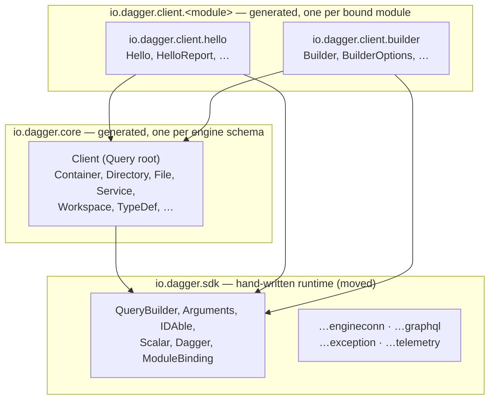
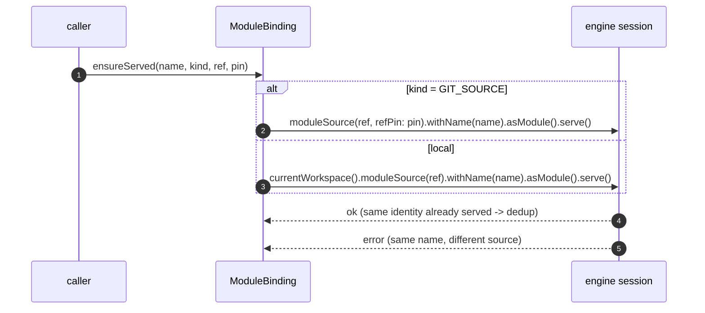
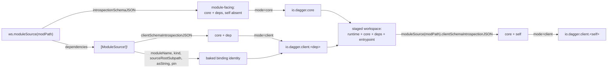

# Modules have clients, not dependencies

Status: proposed
Date: 2026-08-26

## Problem

A module's dependency and a standalone generated client are already the same
thing, built twice.

When a Java module calls a dependency today, it calls generated typed bindings
against a served module. That is the definition of a client. The only thing that
differs from a standalone client — a test, an app, the kind of artifact the Go
and TypeScript SDKs already generate — is *how the session and the target module
are obtained*: inside a module the engine has already served the dependency into
the session schema, while outside the process must open its own connection and
serve the target itself.

This SDK does not model that. It has one generated package, `io.dagger.client`,
produced from `moduleSource.introspectionSchemaJSON` — the *module-facing*
schema, which loads the module's dependencies and merges them into one flat
schema (`Mod.generateModule`, `mod.dang:231`). Every type from core and from
every dependency lands in that single package, next to the hand-written runtime:

```
<module>/sdk/src/main/java/io/dagger/client/**       hand-written runtime
<module>/sdk/src/generated/java/io/dagger/client/**  core + every dependency, flat
```

Three consequences:

1. **There is no client artifact.** Nothing this SDK produces can be handed to an
   application that is not itself a Dagger module. `io.dagger.client.Client` is
   reachable only through `Dagger.dag()`, a process-wide singleton
   (`Dagger.java:6`), and the bindings it exposes are whatever that one module's
   merged schema happened to contain.
2. **Dependency bindings are unattributed.** A dependency's types are
   indistinguishable from core's once generated; nothing in the output records
   which module contributed `Report` or `Binding.asHello`. Regenerating for a
   different dependency set silently changes the meaning of the same package.
3. **The generator only has one mode.** `CodeWriter` hardcodes the target package
   (`CodeWriter.java:20`) and every visitor resolves type references with
   `ClassName.bestGuess(simpleName)`, which is only correct because everything is
   in one package. There is no seam at which a second package could be emitted.

Meanwhile the engine has already moved. `ModuleSource.clientSchemaIntrospectionJSON`
is the *client-facing* schema. Its implementation
(`core/schema/modulesource.go`, `clientSchemaIntrospectionJSONFile`) starts from
the core-only schema builder and installs exactly one module, namespaced, not as
an entrypoint. Its own doc comment is the specification this design builds on:

> only the bound module is installed, as a normal namespaced module, so a
> generated client reaches its functions via `dag.<moduleName>` and never through
> a promoted Query root. The module's own dependencies are deliberately excluded
> — a client is generated for a single module plus core, not for its whole
> dependency graph. Unlike the module-facing schema, it hides no core types.

The Go SDK consumes it already (`go-sdk.dang:360`, `generateClient`). Java does
not consume it at all.

## Decisions

These were the fork-in-the-road questions; they are settled and recorded here so
the rest of the document reads as consequences rather than options.

**D1 — a client is deps-excluded (leaf-shaped).** Confirmed against the engine
source above. A *dependency-authored* type does not cross between two clients.
Core types do, because they are literally the same Java type.

**This costs nothing, because the engine already forbids it.** An earlier draft
of this document claimed cross-dependency composition works today and that D1
gives it up. That was wrong. `Module.validateTypeDef` rejects a module whose API
exposes a dependency-authored type, in all three positions — object fields
(`core/module.go:1220`), function return types (`core/module.go:1244`) and
function arguments (`core/module.go:1262`), each with
`cannot reference external type from dependency module %q`. A module can
therefore never hand a dependency's type to another module in the first place,
so a deps-excluded client cannot lose a capability that does not exist.

Two consequences worth stating, because they fall out of the same fact:

- The merged, deps-included schema this SDK generates today is *wider than
  anything a module is allowed to use*. Flattening it into one package was
  always over-generation.
- A client's schema can only reference core types and its own module's types.
  There is no "type owned by a third module" case for the partition to handle —
  the engine has already made it unrepresentable.

**D2 — the hand-written runtime moves to `io.dagger.sdk`.** `io.dagger.client`
becomes *exclusively* generated: one package segment per bound module, nothing
else, ever.

The reason is naming honesty, not collision avoidance. An earlier draft justified
the move by the risk of a module named `telemetry` or `graphql` colliding with an
SDK subpackage; that argument does not hold up, because the collision set is
exactly four names (`engineconn`, `exception`, `graphql`, `telemetry`) and
`io.dagger.clients.<m>` would avoid it while moving zero files. The real reason
is that `io.dagger.client.QueryBuilder` **is not a client**. Once
`io.dagger.client.<m>` means "the generated client for module m", leaving the
transport at that prefix makes the package name a lie. The collision going away
is a welcome side effect, not the justification.

`io.dagger.runtime` was rejected: this repository already uses "runtime" for the
module runtime (the build/package contract under `runtime/`), so the name would
actively mislead. `io.dagger.sdk` matches both the vendored directory
(`sdk/src/main/java`) and the Maven artifact (`dagger-java-sdk`).

**D3 — the entry point is a static factory, with a static-import alias.**
`Hello.from(dag())` is primary. The same class also carries a static
`hello(Client)` so a caller who prefers it can
`import static io.dagger.client.hello.Hello.hello;` and write `hello(dag())`.
Both are two lines of generated code delegating to one constructor, so offering
both costs nothing and lets the call site choose. A terse `f()` was considered
and dropped: cryptic abbreviations do not belong in a generated public API.

**D4 — both entry points, mirroring the Go SDK.** `generateClient`,
`generateAllClient` (`@generate`, driven by workspace config), and `initClient`,
matching `go-sdk.dang:360/384` field-for-field. `currentModule.asSDK.clients`
exists on the pinned engine (verified by introspection:
`CurrentModuleAsSDKClient { id, module, moduleSource, path, pin }`).

**D5 — a module generates a client for itself, and that is how it calls
itself.** Self calls go through `io.dagger.client.<self>` exactly like calls to
any dependency; there is no separate self-call mechanism. This is a must-have,
not a convenience: a module that cannot reach itself through the engine cannot
benefit from function-level caching on its own calls.

Reading a module's *own* `clientSchemaIntrospectionJSON` installs the module,
which for Java means building it — and the build needs the very sources this
generation is producing. On a first `init` + `generate` there is no `sdk/` at
all. The circularity is real, and it is broken by **bootstrapping through a
staged workspace**, the same device `generateLocalDependencies` already uses for
local dependencies:

1. generate `io.dagger.core` and one client per declared dependency (neither
   needs the module built — see D7);
2. vendor the runtime plus those packages, **carrying over the previously
   committed self client if one exists**, so module code that already references
   it still compiles;
3. run the annotation processor to produce the entrypoint, as today;
4. stage all of that onto the workspace (`ws.withNewDirectory(...)`) — the
   module is now buildable — and read
   `stagedWs.moduleSource(ref).clientSchemaIntrospectionJSON`, which makes the
   engine build and introspect the module;
5. generate the self client from that schema with the same `client` mode, and
   replace the carried-over one.

The carried-over self client is only ever a compile-time crutch for step 4; the
committed output always comes from step 5. Adding a function and calling it
through the self client in the same edit fails the bootstrap build, exactly as
it would in any generated-client workflow: generate first, then call.

The engine already serves a module to itself at call time
(`CallOpts{SkipSelfSchema: false}`, `core/object.go:1436`), so inside the module
the self client's serve is deduplicated by the engine like any other repeat
serve.

Simple-name overlap is the one ergonomic cost: the authored
`io.dagger.modules.hello.Hello` and the generated `io.dagger.client.hello.Hello`
share a simple name, and inside the module the authored one is in scope. The D3
static-import alias is the answer, and it is the documented idiom for self calls:

```java
import static io.dagger.client.hello.Hello.hello;
…
hello(dag()).build(source)   // a self call, through the engine
```

The static import brings in the *method*, not the type, so nothing clashes. A
module named after a core type (`workspace`, `env`, `secret`, `service`, `cache`)
has the same overlap against `io.dagger.core` and the same answer.

**D6 — the query transport becomes public SDK API.** Generated code moves out of
`io.dagger.client`, so every runtime symbol it touches has to be reachable across
a package boundary. Today they are package-private:

| Symbol | Today | Why generated code needs it |
|---|---|---|
| `QueryBuilder` (class, ctor, `chain`, `chainNode`, `execute*`) | package-private | field, ctor param and every field method on every generated type |
| `InputValue` | package-private **interface** | every generated input object has it in `implements` |
| `Arguments.merge` | package-private | optional-argument merging |
| `Scalar.convert()` | package-private | scalar serialization |
| `QueryPart` | package-private | transitively, via `QueryBuilder`'s signature |
| generated `Client` constructors | package-private | `AutoCloseableClient extends Client` becomes cross-package |

`InputValue` is the one that makes this non-negotiable rather than a preference:
a class cannot implement a non-public interface from another package. Without
D6 the cutover simply does not compile.

This **reverses a decision already recorded in this repo's design corpus**:
`hack/designs/2026-08-17-nullable-object-returns.md` deliberately kept
`QueryBuilder` package-private and rejected a public transport seam as permanent
API surface. That reasoning was right for that change and does not survive this
one — generated code in another package cannot be served by a package-private
transport. The reversal is deliberate and is called out here rather than made
silently. A public `Client.queryBuilder()` accessor is added too; it does not
exist today.

**D7 — `io.dagger.core` depends on the engine and the consumer, never on a
bound module.** Core is generated from the schema the *consumer* is entitled to
see, partitioned to strip every module-owned symbol:

- a **module** gets its core from its own module-facing
  `introspectionSchemaJSON`. That schema loads the module's dependencies but
  never the module itself (`moduleSourceIntrospectionSchemaJSON` →
  `loadDependencyModules` → `SchemaIntrospectionJSONFileForModule`), so there is
  no circularity, and it hides `TypesHiddenFromModuleSDKs` — which means
  `dag().host()` in module code **stays a compile error**, closing the guard
  regression an earlier draft had accepted;
- a **standalone client** gets its core from the bound module's client-facing
  `clientSchemaIntrospectionJSON`, which hides nothing, because a client is
  allowed everything the CLI is.

Both are "the engine's core, as this consumer is allowed to see it". The
dependency-owned symbols in the module-facing schema are exactly what the
partition strips, so the result is core-only either way. Because every
`io.dagger.client.<m>` package refers to core types only by name, the
per-module client bytes are identical across both contexts even though the
*core* package legitimately differs (hidden types, compatibility view). That is
the property the byte-identity claim is about.

The compatibility view is the residual risk: the engine renders core through the
target module's declared `engineVersion` (`core/schema/modulesource.go:3537`),
and a dependency declared at a pre-`v1.0.0` version gets legacy per-type ID
scalars (`Sub1ID`, `loadSub1FromID`) that a `v1.0.0` core does not have.
Generation therefore fails early and clearly when a dependency declares an
`engineVersion` below `v1.0.0-0`, the floor this SDK already requires. Anything
subtler surfaces as a compile error in the vendored SDK build, which is loud if
not pretty.

**D8 — the SDK can open its own session again.** `Connection.get` regains the
path that `89b80fe` removed as dead code: honour `DAGGER_SESSION_PORT` /
`DAGGER_SESSION_TOKEN` when set (a module runtime, or `dagger run`), otherwise
spawn `dagger session --label dagger.io/sdk.name:java …`, read the
`{port, session_token}` line it prints, and connect. The binary comes from
`_EXPERIMENTAL_DAGGER_CLI_BIN` or `dagger` on `PATH`. This is precisely what the
Go SDK (`dagger.Connect`) and the TypeScript SDK
(`sdk/typescript/src/provisioning/bin.ts:176`) do, minus one thing: both also
auto-download a CLI matching their version when none is found. The Java SDK does
not, in this series — like Testcontainers using whatever Docker the host has, it
uses the `dagger` the host has, and says so clearly when there is none. Download
is a follow-up, not a blocker, and it needs the checksum-verifying downloader
and archive dependencies that were dropped for weight.

`ProcessBuilder` is enough for the session process; the `fluent-process`
dependency that the old `CLIRunner` used is not reintroduced. `AutoCloseableClient`
closes the session process it started; a connection taken from the environment
owns nothing.

**D9 — the SDK stages its own local dependencies.** `mod.dang` no longer calls
the engine's `ModuleSource.generateLocalDependencies`. That routes through
`Workspace.generators(include: [<owning SDK>])`, and two things make it
unusable here, both verified against engine source and by probing:

- the engine returns an **empty generator group for any value workspace**
  (`isSyntheticWorkspace` → `IsValueWorkspace`: a workspace built from a
  `Directory`, which is what every in-memory e2e check runs in), so a Java
  module with a local Java dependency can never be generated in a check;
- in this repository the rollup carries exactly four generator nodes
  (`dagger-dang-sdk`, `packager`, `sdk-sdk`, `templates`) and none for
  `java-sdk`, on `upstream/main` as much as here, whatever the root config
  says — so the engine path had never actually worked for this SDK.

Instead, `generatedOverlay` recurses: for each dependency that is not git and
sits in the modules registered to this SDK in the workspace (`ws.sdk(name:
currentModule.name).modules` — the registry, not the cwd-scoped
`modules(ws)`, since a dependency is usually a sibling), it generates that
module and overlays its `sdk/` and `src/generated/java` onto the workspace with
`withNewDirectory`. Overlays rather than changesets, because a changeset is
measured from the caller's cwd and may not reach a sibling. Dependencies of
other SDKs, remote ones, and skip-marked ones are assumed committed — the same
rule the engine applies.

Two facts about module sources inside a value workspace follow from the same
probing and are handled explicitly: a local dependency reports
`kind = DIR_SOURCE` (not `LOCAL_SOURCE`) with an empty `asString`, so ownership
is decided on "not git", and the binding baked into a client is normalized to
`LOCAL_SOURCE` by workspace path for both — which also keeps the bytes
identical between a client generated in a value workspace and on the host.

### Where the Go and TypeScript SDKs actually are

Worth stating plainly, because it sets expectations for review:

- **Go SDK**: has `generateClient` / `generateAllClient` / `initClient` exactly as
  D4 describes, and this design copies that shape. But Go *module* generation
  still delegates to the engine (`generatedContextDirectory`, `mod.dang:72`),
  which uses the module-facing merged schema. **Go has not unified
  dependencies-as-clients.**
- **TypeScript SDK**: `design/client-gen.md` describes the client schema as
  having "deps loaded" and the target module's "own types promoted to `Query`
  for self-bindings". **Both statements are stale** against the engine source
  quoted above. Do not use that document as the spec for this one.

So the `generate-a-client` half of this work has a proven reference to copy, and
the `dependencies-become-clients` half does not. Java is first there. That is
where the design risk is concentrated.

## Goals

- One generator, one output shape. The package generated for a module is
  byte-identical whether it was produced because another module declared that
  module as a dependency or because someone asked for a standalone client.
- Core types live in their own package, shared by every generated client.
- A module declares a dependency in `dagger-module.toml` exactly as it does
  today; what changes is that the SDK generates a *client* for it.
- Produce a standalone client artifact that an ordinary Maven project can build
  and run — structurally the analogue of what the Go and TypeScript SDKs emit,
  including opening its own engine session (D8).
- A single engine session shared by every client in a process.
- One idempotent serve preamble: a no-op where the target module is already
  served, a real bootstrap where it is not, with no context-dependent branch in
  the generated code.

## Non-goals

- **No compatibility shim.** `io.dagger.client.Container` and friends move. There
  is no alias package, no deprecation window, no dual-mode generator. Breaking
  compatibility is in scope and intended.
- **No cross-module type composition between two dependency clients.** See D1.
- **No engine changes.** Everything this needs already exists on
  `v1.0.0-beta.10`. If a gap appears, it is a separate `dagger/dagger` proposal,
  not a patch in this series.
- **No published Maven artifacts.** The SDK stays self-contained and vendored, as
  the README describes. A standalone client vendors what it needs.
- **No CLI auto-download.** The SDK opens a session with the `dagger` binary
  the host provides; fetching one is follow-up work (D8).
- No change to module authoring: `@Object`, `@Function`, the entrypoint, and the
  two-pass pom stay as they are, and `dag().host()` in module code stays a
  compile error (D7).

## Approach

### The unification, precisely

A generated client is **generated bindings plus a serve preamble**, where the
preamble is idempotent. It probes whether its bound module is already present in
the session schema; if it is, the preamble does nothing, and if it is not, it
serves it. Inside a module the dependency has already been served by the engine,
so the probe short-circuits. Outside, the probe misses and the preamble serves.
The generated bytes are the same either way, because the branch is taken at
runtime against session state, not at generation time against context.

That is the whole feature. Everything below is the mechanics of making the
generator emit one artifact instead of one flat package.

### Package layout



- `io.dagger.sdk` is the hand-written SDK runtime, moved wholesale from
  `io.dagger.client`. Its subpackages keep their relative names
  (`io.dagger.sdk.engineconn`, `.exception`, `.graphql`, `.telemetry`). One class
  is added: `ModuleBinding`, the serve preamble.
- `io.dagger.core` is new and holds the generated core API, including `Client`
  (the `Query` root). This is the only package whose contents depend on the
  engine version alone.
- `io.dagger.client.<module>` is new, one package per bound module, holding only
  the types that module contributes plus its entry point. A module named `hello`
  produces `io.dagger.client.hello`. Nothing hand-written lives under
  `io.dagger.client` any more, so a module name can never collide (D2).

`io.dagger.core` referring to `io.dagger.sdk.QueryBuilder` while
`io.dagger.sdk.Dagger` refers to `io.dagger.core.Client` is a package cycle. Java
permits it and both are compiled in the same pass; it is called out here so it is
a decision rather than an accident. Removing it would mean moving `Dagger` into
the generated package, mixing hand-written code into generated output, which is
worse.

Module names are still normalized to a legal Java package segment (lowercased,
`-` stripped), and a name that cannot be normalized fails at generation time with
a clear error.

### Type attribution: `@sourceMap` is the partition

The introspection JSON already says which module contributed each type and each
field: the engine emits `@sourceMap(module: "<name>", …)` on both. Core types and
core fields carry no `module`. `dagger/dagger`'s own codegen partitions on
exactly this (`cmd/codegen/introspection/filters.go`, `isOwnedByModules`), and
this SDK already parses directives on `Type` and `Field`
(`Type.java:86`, `Field.java:84`) — only the accessor is missing.

So the partition is exact, needs no second schema, and needs no name-prefix
heuristics:

- a type whose `@sourceMap.module` is empty belongs to `io.dagger.core`;
- a type whose `@sourceMap.module` is `M` belongs to `io.dagger.client.<m>`;
- a **field** whose `@sourceMap.module` is `M`, on a type that belongs to core,
  is a module extension of a core type (`Query.hello`, `Binding.asHello`) and
  belongs to `M`, not to core.

This is verified against a real schema, not assumed. Dumping
`clientSchemaIntrospectionJSON` for `.dagger/modules/e2e` (which declares a
`java-sdk` dependency) on the pinned engine gives 124 types, of which:

- exactly one type carries `@sourceMap(module: "e2e")` — `E2E`;
- eight *fields* carry it — the seven `@check` functions on `E2E`, plus
  **`Query.e2E`**, which is precisely the "module extension on a core type" case
  the partition has to handle;
- `JavaSdk` and `Mod` — the dependency's types — are **absent**, confirming D1
  empirically as well as from the source;
- `Container`, `Directory`, `File`, `Service`, `Workspace` and `Host` are all
  present and unhidden.

Two implementation details fall out of that dump and are easy to get wrong:

- the directive argument is a **JSON-quoted** string (`"\"e2e\""`), so
  `getSourceMapModule` must strip the surrounding quotes exactly as the existing
  `Directive.getExpectedType` already does;
- **the module's root type name cannot be derived by capitalizing the module
  name.** Module `e2e` has root type `E2E`, not `E2e`. The root type must be read
  off the schema — it is the return type of the `Query` field owned by that
  module (`Query.e2E` → `E2E`). Generating the name by string manipulation
  produces a type that does not exist.

**Module-owned fields on core types need somewhere to go.** `Query.e2E` is the
entry point and is handled by the factory, but the engine also lets a module
extend `Binding` and `Env` — `cmd/codegen/introspection/filters.go:5` lists the
extendable types as `Query`, `Binding` **and** `Env` (the earlier draft of this
document said "just Query", which was wrong). Java has no extension methods, so
`Binding.asHello()` has no home in `io.dagger.client.hello` and no business in
`io.dagger.core`.

These are emitted as **static shims on the module's entry-point class**:

```java
public static Hello asHello(io.dagger.core.Binding binding) {
  return new Hello(binding.queryBuilder().chain("asHello"));
}
```

Without this rule the partition silently deletes the whole LLM/agent surface for
module types (`Binding.asHello`, `Env.withHelloInput`, `LLM.hello`). Dropping
them would be a capability loss disguised as a partition detail, so it is made
an explicit emission rule with its own test.

Field-level attribution is applied to *every* type, not only to `Query`.
`dagger/dagger`'s Go filter restricts field filtering to an `ExtendableTypes`
list containing just `Query`, which leaves a module-contributed `Binding.asHello`
in the core partition while its return type is filtered out of it. Java cannot
tolerate that — it is a compile error, not a soft inconsistency — so the stricter
rule is used here.

### Generation modes

`DaggerCodegenMojo` gains a mode and a target package. Both modes read one
`clientSchemaIntrospectionJSON` — core plus exactly one module:

| mode | emits | into |
|---|---|---|
| `core` | every type and field with no owning module, plus the non-schema emissions `Version` and `JsonConverter` | `io.dagger.core` |
| `client` | every type and field owned by module `M`, plus `M`'s entry point and its core-type shims | `io.dagger.client.<m>` |

`Version` (`VersionVisitor`) and `JsonConverter` (`IDAbleVisitor`) are not schema
types, so they do not fall out of the partition and would otherwise be emitted
into *every* package. `JsonConverter` in particular is imported by name by the
annotation processor, so a duplicate in a client package is an ambiguous import.
Both are core-mode only.

In `client` mode, references to non-owned types resolve to `io.dagger.core`
rather than to the local package. A `TypeRegistry`, built once from the schema
partition, replaces every `ClassName.bestGuess(simpleName)` in the visitors and —
critically — in `TypeRef`, which is the actual type-reference resolver. That
substitution is the bulk of the codegen change and is mechanical.

Because `core` mode drops everything with an owning module, the core package it
emits is identical no matter which module's client schema it was derived from.
That is what makes `io.dagger.core` shareable, and it is asserted by a test
rather than assumed.

### The serve preamble

The entry point generated into `io.dagger.client.<m>` is a static factory on the
module's root type, plus the D3 alias:

```java
package io.dagger.client.hello;

public class Hello {
  public static Hello from(io.dagger.core.Client dag) {
    QueryBuilder qb = dag.queryBuilder();
    ModuleBinding.ensureServed(qb, "hello", "Hello", "LOCAL_SOURCE", "dagger/modules/hello", "");
    return new Hello(qb.chain("hello"));
  }

  /** Alias for {@link #from}, for use with a static import. */
  public static Hello hello(io.dagger.core.Client dag) {
    return from(dag);
  }
  …
}
```

Java has no extension methods, so `dag().hello()` would require regenerating the
core `Client` per bound module — which would make core non-shareable and the
client non-identical. The static factory is the cost of the language.

The five baked values are the bound module's identity, and they depend only on
that module — never on the consumer. That is why the emitted bytes are identical
in every context. They come off the module source exactly as the Go SDK reads
them (`moduleOriginalName`, `kind`, the ref, `asString`, `pin`).

`ModuleBinding.ensureServed` is hand-written runtime, so the generated code
carries data and no logic. It **serves on the first call and remembers the exact
tuple it served, per session** — there is no probe:



An earlier draft probed `{ __type(name: rootType) { name } }` first and skipped
the serve when the type was present. That is removed, because the engine already
does the right thing and does it atomically. `Server.serveModule`
(`engine/server/session.go:1960`) looks the module up by name and:

- if it is **not** served, serves it;
- if it **is** served from the same source and pin, `isSameModuleReference`
  matches and the call succeeds — `With` "handles deduplication and promotion
  internally";
- if it is served from a *different* source, it returns
  `module %s ... already exists with different source %s`.

So unconditional serving is idempotent for free, and the probe was strictly
worse than useless: `__type` only proves a type *name* exists, so it would skip
serving when a **different** module of the same name was already present —
silently binding the caller to the wrong module and suppressing exactly the
conflict the engine is there to report. The `Module.serve` doc comment saying
"once per session" is stale relative to this implementation.

Dropping the probe also removes the need for `QueryBuilder` to express a raw
`__type` query (it cannot — it only builds `{field{field}}` chains). The
preamble is now pure data plus one engine call.

**The guard that stays is a cache of successfully served tuples, keyed on the
session.** `ModuleBinding` holds a weak map from `GraphQLClient` to the set of
`(name, kind, ref, pin)` tuples that have been served on it, and skips a repeat
of an exact tuple. That is not the probe wearing another hat, and the difference
is the reason it is safe: the probe would have skipped a serve *before* the
engine had ever been asked about that name, so a different module already served
under it went unreported. The cache only ever skips a serve the engine has
already accepted for that exact source and pin — a conflict would have errored
on the first call — so nothing it suppresses could have failed. Without it every
entry-point call in a module pays a round trip on a serve the engine has already
deduplicated, which is the common case, not the rare one.

The bound module's **final** name — after any `withName` alias — is what gets
baked and what the serve applies. The engine applies dependency aliases with
`withName` (`core/modulesource.go:1978`) and namespaces the schema by the final
name (`core/gqlformat.go:36`), so a client generated for a dependency aliased to
`alias` chains `alias` and must serve under `alias` too. Using
`moduleOriginalName` here would generate a client that chains one name while
serving another — a runtime wrong answer, not merely different bytes.

Local bindings bake the module's **workspace-relative** path, resolved through
`currentWorkspace().moduleSource(path)` — never a cwd-relative or absolute host
path. A local binding does not survive being shipped away from the workspace; a
git binding does. That limitation is the engine's and is repeated in the
generated javadoc rather than papered over.

### Where the schemas and identities come from

All of it is reachable from dang today, with no engine change:



`ModuleSource.dependencies` returns `[ModuleSource!]!` with dependency aliases
already applied, so each dependency's client schema, its **final** name
(`moduleName`), and its identity (`kind`, `sourceRootSubpath` for a local
module, `asString` and `pin` for git) come straight off the graph. The self
client comes from the staged workspace per D5.

One codegen invocation handles every package. `DaggerCodegenMojo` reads a
**plan directory** — `<plan>/<entry>/schema.json` plus
`<plan>/<entry>/meta.json` carrying `mode`, `module`, and the binding identity —
and emits all entries into one output tree in a single Maven run, so the number
of dependencies does not multiply Maven invocations. The self client is a second,
codegen-only run over a one-entry plan after the bootstrap build. The Mojo cleans
the SDK-owned generated package roots it is about to write before writing, so a
removed dependency or a renamed alias does not leave a stale package behind.

`mod.dang:226` already stages `generateLocalDependencies(ws)` before resolving
the module source, so a local dependency's own generated output is up to date
before its client schema is read. That staging is kept.

### What a module's tree looks like

```
<module>/sdk/src/main/java/io/dagger/sdk/**                 runtime (vendored, moved)
<module>/sdk/src/processor/java/**                          processor (vendored)
<module>/sdk/src/generated/java/io/dagger/core/**           core API
<module>/sdk/src/generated/java/io/dagger/client/<self>/**  the module's own client (D5)
<module>/sdk/src/generated/java/io/dagger/client/<dep>/**   one package per declared dependency
<module>/src/generated/java/io/dagger/gen/entrypoint/**     entrypoint (unchanged)
```

Everything stays under the existing `sdk/src/generated/java` source root, so the
module pom needs no change.

### What a standalone client looks like

`generateClient(ws, module, path)` produces a plain Maven project:

```
<dir>/pom.xml                                            seeded when absent, then the user's
<dir>/sdk/src/main/java/io/dagger/sdk/**                 runtime (vendored)
<dir>/sdk/src/generated/java/io/dagger/core/**           core API
<dir>/sdk/src/generated/java/io/dagger/client/<mod>/**   the bound module's client
```

Everything generated sits under `sdk/`, exactly as in a module, so the user's
own `src/main/java` is never touched and the whole of `sdk/` can be dropped and
rewritten on every run. The pom is rendered from `client-template/` by the same
helper that renders module templates — it sits outside `templates/`, which is
the list of *module* init templates — so there is one source of truth for the
dependency list.

`sdk/src/generated/java/io/dagger/client/<mod>/**` is byte-identical to the
`sdk/src/generated/java/io/dagger/client/<mod>/**` that a module depending on
`<mod>` receives. This is the feature's central claim, and it is checked
directly (see Testing).

Stated precisely, because the unqualified version is false: the emitted bytes are
identical **for a fixed binding tuple** — final module name, source kind,
canonical ref or workspace-relative path, pin, compatibility view, schema bytes,
and generator revision. The same module resolved locally and from git is *not*
byte-identical, and should not be: a local binding bakes a workspace-relative
path and no pin, a git binding bakes a canonical ref and a pin
(`core/modulesource.go:978,991`). What the claim rules out is the *context* — who
is generating, and whether the consumer is a module or a standalone project —
mattering. That is the property worth having, and it is the one tested.

The claim is about **content**, not about file modes, and the check normalizes
modes before comparing digests. Codegen emits one mode everywhere
(`Codegen.sdkBuilt` chmods its output, so the number of passes cannot change
it), but a `Changeset.layer` does not carry that mode through: the engine writes
a module's generated tree into the workspace at 0666/0777 while a standalone
client's lands at 0644/0755, from byte-identical 0644 input. Measured by
exporting both trees. The mode is the workspace's to decide, so the check
levels it and still compares every byte and the whole shape.

`generateAllClient(ws)` is the `@generate` rollup over
`currentModule.asSDK(workspace: ws).clients`, the same API `generateAll` reads
the module list from (`CurrentModuleAsSDKClient{path, module, moduleSource,
pin}`). Cwd-scoped exactly as `generateAll` already is for modules: the engine
owns the list, the cwd policy, and the resolution of each bound module, so the
local-vs-git branch `go-sdk.dang:384` writes by hand is not needed here — the
`moduleSource` the engine hands back is already resolved. `initClient` seeds the
SDK-owned files for a newly registered client — for Java that is `pom.xml` (the
Go SDK needs none, so its `initClient` is empty).

## Alternatives considered

**Keep the merged, deps-included schema and just split packages.** Split
`io.dagger.client` into core plus one package per dependency, still generated
from `introspectionSchemaJSON`. This preserves cross-module type composition and
is less work. Rejected: the resulting packages are not clients — they cannot be
generated outside a module, because the module-facing schema exists only for a
module. It would produce a nicer version of today's problem, not the unification.

**A per-module wider schema (core + all of that module's client-deps together).**
Keeps today's ergonomics — dependency-authored types interoperate across a
module's own clients — at the cost of a schema-sharing mechanism the engine does
not expose, and of clients whose bytes differ between the module and standalone
cases, which contradicts the central goal. Rejected per D1; it remains the escape
hatch if dependency-type crossing turns out to matter in practice, and it would
begin as a `dagger/dagger` proposal.

What is actually lost is narrower than it looks. Core types cross freely: a
`Container` returned by client A and passed to client B is
`io.dagger.core.Container` on both sides — the same Java type, no conversion.
Only a *dependency-authored* type crossing between two different clients is
unsupported.

**Keep the runtime in `io.dagger.client`.** Fewer files move. Rejected per D2:
it leaves transport code under a prefix that means "generated client".

**`io.dagger.clients.<m>` for the generated clients instead.** Reserves no names,
moves no files, and removes the collision just as completely — on the
collision criterion alone it dominates D2. Rejected anyway: `io.dagger.client`
and `io.dagger.clients` differing by one letter, with completely different
contents, is worse to read and to import than moving the transport once.

**Move the runtime into `io.dagger.core` as well.** Would remove the package
cycle. Rejected: it conflates "the schema-derived API" with "the transport",
which are versioned by different things, and puts hand-written files inside a
generated package.

**Serve unconditionally and ignore an "already served" error.** Fewer round
trips. Rejected: it depends on matching an engine error string, which is not a
contract.

**Publish `io.dagger:dagger-java-core` to Maven and depend on it.** What the
TypeScript SDK does with `@dagger.io/dagger`. Rejected: it contradicts this
repository's self-contained, no-published-artifact design, and it would make
generation depend on release infrastructure that does not exist yet.

## Affected components

| Component | Change |
|---|---|
| `sdk/dagger-codegen-maven-plugin` | `CodeWriter` takes a package; new `TypeRegistry` and schema partition; all visitors **and `TypeRef`** resolve through the registry; `Directive.getSourceMapModule`; new entry-point emission; `DaggerCodegenMojo` gains `mode`, `package`, `module`, and binding parameters |
| `sdk/dagger-java-sdk` | package move `io.dagger.client` → `io.dagger.sdk`; new `io.dagger.sdk.ModuleBinding`; `Dagger` returns `io.dagger.core.Client`; generated-type constructors widened to public so cross-package construction works |
| `sdk/dagger-java-annotation-processor` | imports and hardcoded type names move to `io.dagger.sdk.*` / `io.dagger.core.*` |
| `mod.dang` | `generateModule` drives core generation off the module-facing schema, one client per declared dependency off each dependency's `clientSchemaIntrospectionJSON`, and the self client through the staged-workspace bootstrap; rejects dependencies declared below `v1.0.0-0` |
| `sdk/dagger-java-sdk` (`engineconn`) | `Connection.get` regains `dagger session` provisioning behind the environment path (D8) |
| `prebuilt/m2` | regenerated — `mod.dang` prefers the committed codegen plugin whenever `prebuilt/m2/io/dagger` exists, so codegen changes are inert until the plugin jar is rebuilt and committed |
| `client.dang` (new) | client generation: schema, identity, vendoring, pom |
| `main.dang` | `generateClient`, `generateAllClient` (`@generate`), `initClient` |
| `templates/{default,empty,legacy}` | imports move |
| `sdk/dagger-java-samples` | imports move |
| `.dagger/modules/e2e` | new fixtures and checks (below) |
| `README.md` | the layout section and the generation description |

## Testing

What exists, exactly.

Unit, in `dagger-codegen-maven-plugin` (`mvn -Ptests --projects
dagger-codegen-maven-plugin test`):

- `SchemaPartitionTest` — a fixture schema with `@sourceMap` on types and on
  fields splits into the expected core and module sets, including a
  module-contributed field on a core type (`Binding.asHello` goes to the module,
  `Binding` stays in core); core is the same whichever module the schema was
  bound to; narrowing does not mutate the schema it came from; `Version` and the
  IDAble helpers are core-only.
- `SourceMapAttributionTest` — the directive accessor, including the
  JSON-quoted value and the field-on-a-core-type case.
- `GeneratorTest` — a plan emits core and one package per client into one tree;
  core's *bytes* do not depend on which module's schema they came from; a full
  plan drops the client packages it does not mention except the kept one, and a
  plan without core touches nothing else; two modules naming one package are
  rejected; a plan holds at most one core.
- `ModuleClientCodegenTest` — the `from(Client)` factory with the module's
  constructor arguments, the static-import alias, a git binding's ref and pin, a
  shim on `Binding` (with its preamble starting at the session root), the root
  type read off the schema (`e2e`/`E2E`), a module named after a core type
  rejected, two shims of one field name getting helper classes of their own,
  schema arguments escaped where they would shadow a generated local, package
  segments, and that the emitted client compiles against stubs of core and the
  runtime.
- `NullableObjectCodegenTest`, `SchemaTest`, `DaggerCLIUtilsTest` — the
  pre-existing nullable-object surface, the version gate, and `dagger version`
  parsing.

Unit, in `dagger-java-sdk` (needs `-Ddaggerengine.schema`):

- `ModuleBindingTest` — over a fake engine: a local module served by workspace
  path under its final name, a git module by canonical ref and pin, an unpinned
  git module, a binding served once per client and again for a different name or
  a second client, and a source kind a client cannot serve rejected before any
  request.
- `QueryBuilderTest` — `root()` drops the selection and keeps the session, plus
  the nullable-object query shapes.
- `CLISessionTest` — the announcement is parsed, the process is stopped by
  `close()` and by a failure to read the announcement, a CLI that exits without
  announcing and a missing CLI are explained.

e2e, as `@check` functions in `.dagger/modules/e2e` — three, each running real
generation in the engine:

- `clients-generate-check` — generating fixture module `app` (which declares
  `dep`, and `dep` again aliased to `greeter`) from nothing produces
  `io.dagger.core`, both dependency clients and app's own client; `Host` is
  absent, so it stays hidden from module code; the dependency client serves
  `dep` by workspace path and the aliased one serves `greeter`; core types
  returned by a dependency resolve to `io.dagger.core`; with the self client
  vendored the module calls itself and a second generate picks the new function
  up; a committed client package the plan no longer mentions is removed; and a
  third generate with no edits changes nothing.
- `standalone-client-check` — a standalone client for `dep` is
  **byte-identical** (`Directory.digest`, over trees levelled to one file mode —
  see the byte-identity note above) to the client `app` vendors for it,
  sees `Host`, is named after its directory, and builds with a plain `mvn
  package` together with a `main` that uses it.
- `registered-client-check` — `initClient` seeds the pom and nothing else, the
  `@generate` rollup materializes the registered client from workspace config,
  and a second rollup on the applied result is an empty changeset.

What stays untested, plainly:

- **No generated client is invoked at runtime through the engine.** The e2e
  checks compile and build; nothing calls `dep(dag()).greet("x")` and asserts
  the answer. That needs committed generated fixtures or a git-bound module.
  The unit tests cover the request shapes the preamble sends.
- **Git-bound dependencies and clients.** Every fixture is local. The git branch
  of the binding is covered by unit tests on the emitted code and on
  `ModuleBinding`, not end to end.
- **Session provisioning end to end.** `CLISessionTest` drives a fake CLI; no
  check opens a real `dagger session` from a standalone client and calls
  through it.

Regression surface that must stay green: the existing e2e checks, the `sdk-sdk`
contract suite (`seeds-files`, `does-not-write-config`, `honors-custom-path`, the
`chain` generation checks), `packager:unit-tests`, and `templates:generate`.

## Risks

- **Blast radius.** Every generated import in every Java module changes, and D2
  moves every hand-written runtime file too. This is intended and unavoidable
  given the no-shim decision, but it means a broken intermediate patch is very
  visible. Mitigated by ordering the series so the tree builds at every patch and
  by the two-pass pom being unchanged.
- **Java is first at deps-as-clients.** The Go SDK's module generation still uses
  the engine's merged schema, so there is no reference implementation for the
  half of this design that turns dependencies into clients — only for the
  standalone-client half. Expect the dependency path to need more iteration.
- **`Host` and `Engine*` stay hidden from module code, and are visible to a
  standalone client.** An earlier draft of this bullet had them leaking into
  modules; D7 is what closes it. A module's core comes from its own
  module-facing `introspectionSchemaJSON`, which hides
  `TypesToIgnoreForModuleIntrospection` and `TypesHiddenFromModuleSDKs`, so
  `dag().host()` in module code stays a compile error. Only a standalone
  client's core comes from the client-facing schema, which hides nothing — which
  is correct, because a client is allowed everything the CLI is. The e2e
  generate check asserts `io/dagger/core/Host.java` is absent from a module and
  present in a standalone client.
- **`serve` once-per-session.** Serving is idempotent in the engine for an exact
  source and pin; the per-client cache of served tuples keeps the repeat off the
  wire. `ModuleBindingTest` pins both the request shapes and the call counts.
- **Simple-name overlap.** The authored `io.dagger.modules.<m>.M` and the
  generated `io.dagger.client.<m>.M`, and a module named after a core type
  against `io.dagger.core`. Compiles — JavaPoet emits fully-qualified names —
  and the static-import alias is the idiom that keeps call sites clean (D5).
- **Bootstrap cost.** The self client adds one engine-driven module build per
  `generate`. It is the same class of cost `generateLocalDependencies` already
  pays for each local dependency, and it is cached by the engine across
  unchanged inputs.
- **Self serve identity.** Inside a module, the self client serves
  `currentWorkspace().moduleSource(<self path>)`; the engine deduplicates only
  if that resolves to the same canonical reference it served the module under.
  The self-client e2e check is what proves it; if it does not match, the fix is
  in how the path is baked, not in the design.
- **Dependency-authored types cannot cross clients.** Accepted per D1. The
  generator fails loudly at generation time when a client's schema references a
  type it cannot resolve, rather than emitting code that does not compile.
- **Constructor visibility widening.** Generated types need public `QueryBuilder`
  constructors for cross-package construction, which enlarges the public surface
  of generated classes. Documented as internal in the generated javadoc; no
  better option exists without sealing, which Java 17 does not offer across
  packages.
- **A standalone client cannot deserialize IDs against its own session.** The
  generated `Deserializer` nested classes resolve through `Dagger.dag()`, the
  process-wide singleton, so a client opened with `Dagger.connect()` has
  `JsonConverter` talking to a different session than the one it holds. This is
  the pre-existing singleton model, not something this series introduces;
  threading the session through deserialization is follow-up work.
- **No startup timeout on a spawned session.** `CLISession.start` reads the
  CLI's stdout until it announces a port and token or exits, so a `dagger
  session` that hangs before announcing hangs the caller. The CLI's own
  behaviour is the bound; a deadline is follow-up work.

# Implementation plan

Stacked Git series on `unified-clients-lead-c699e437`, based on `upstream/main`
@ `d806484`. Every patch carries
`Signed-off-by: Yves Brissaud <yves@dagger.io>`.

Ordering constraint discovered in review: the transport must become public
(D6) **before** anything is generated outside `io.dagger.client`, and the
package move must land before the generator starts emitting multiple packages.
Each patch below compiles on its own; the codegen learns the new shape while
still driven in a single-package configuration, and the switch-over is one
patch with every consumer.

### Patch 1 — `hack/designs`: this document ✅

### Patch 2 — `codegen`: read `@sourceMap` module attribution ✅

`Directive.getSourceMapModule`, stripping the JSON quotes around the value as
`getExpectedType` does, plus `Type.getOwningModule()` and
`Field.getOwningModule()`. Tests cover the `Query.e2E` field-on-a-core-type case.

### Patch 3 — `codegen`: partition a schema into core and one module

`SchemaPartition`: given a schema and a module name, the core type set (types
with no owner, with owned fields removed) and the module type set (owned types,
plus owned fields on core types, which become the shims). Unit tests including
the `Binding.asHello` case and core stability across two modules.

### Patch 4 — `codegen`: resolve type references through a registry

`TypeRegistry` maps a GraphQL type name to a `ClassName`. `CodeWriter` takes a
target package. Every `ClassName.bestGuess(...)` goes through the registry — in
`ObjectVisitor`, `InterfaceVisitor`, `InputVisitor`, `ScalarVisitor`,
`IDAbleVisitor`, `Helpers`, and **`TypeRef`** (the actual resolver). Behaviour
unchanged: the registry maps everything to one package.

### Patch 5 — `sdk`: widen the query transport to public API (D6)

`QueryBuilder` (class, constructor, `chain`, `chainNode`, `execute*`),
`InputValue`, `Arguments.merge`, `Scalar.convert()`, `QueryPart`, and a new
public `Client.queryBuilder()` accessor. Generated `Client` constructors widen so
`AutoCloseableClient` can extend across packages. No package has moved yet, so
this patch is pure visibility plus one accessor, and the existing tests pin the
behaviour.

### Patch 6 — `sdk`: move the runtime to `io.dagger.sdk` (D2)

The package move, mechanical, with every in-repo consumer updated in the same
patch (SDK, processor, samples, templates). No behaviour change; the generated
package is still `io.dagger.client`.

### Patch 7 — `sdk`: `ModuleBinding`, the unconditional serve preamble, and session provisioning (D8)

Landed before the entry-point codegen (they are swapped relative to the first
draft) so that the generated code never references a runtime class that does
not exist yet.

### Patch 8 — `codegen`: emit the entry point, the alias, and the core-type shims

The static `from(Client)` factory, the D3 `<module>(Client)` alias, the static
shims for module-owned fields on `Query`/`Binding`/`Env`, and module-name
normalization. The root type is resolved **from the schema** — the return type of
the `Query` field owned by the module — never by capitalizing the module name,
which gives `E2e` where the real type is `E2E`. Binding identity uses the
module's **final** name, so an aliased dependency chains and serves the same
name. Unit tests pin the local binding, the git binding, the `e2e`/`E2E` case,
and an aliased binding.

Hand-written `io.dagger.sdk.ModuleBinding`: no probe — serve the exact binding,
let the engine deduplicate, and remember the tuple per session so a repeat costs
nothing. Applies `withName(finalName)`. Unit tests over a faked engine cover
local, git, alias and repeat calls, and assert the request count so the
once-per-client rule is observed rather than inferred.

In the same patch, `Connection.get` regains `dagger session` provisioning
(`ProcessBuilder`, no new dependency) behind the environment path, and the
connection shuts the session process down. A unit test drives it with a fake
`dagger` script that prints the announcement line.

### Patch 9 — the cutover

One patch, because the tree cannot build between halves:

- `DaggerCodegenMojo` reads a plan directory (one entry per package, each with
  its schema and `meta.json`) and cleans the package roots it writes; a plan
  that carries core also drops every client package it does not mention,
  except the one named by `keep` — the module's own previous self client,
  carried through the first pass so module code that already calls it still
  compiles; the single-schema form it accepts today becomes a one-entry core
  plan;
- `io.dagger.core` is generated from the consumer's schema (D7);
- the annotation processor's hardcoded type names move to `io.dagger.core`;
- templates and samples move.

### Patch 10 — `prebuilt`: regenerate the committed codegen plugin

`mod.dang` prefers `prebuilt/m2` whenever it exists, so every codegen change
above is inert in module generation until the plugin jar is rebuilt and
committed. `packager:generate` produces it; this patch commits the result.

### Patch 11 — `mod.dang`: generate core, one client per dependency, and the self client

`generateModule` builds a plan (core from the module-facing schema, one
`client` entry per `modSource.dependencies`), vendors the result with the
previous self client carried over, produces the entrypoint, stages everything
onto the workspace, reads the module's own client schema off the staged
workspace, and generates the self client from a one-entry plan (D5). Rejects a
dependency declared below `v1.0.0-0`. Keeps the existing
`generateLocalDependencies` staging.

### Patch 12 — `client.dang` + `main.dang`: standalone clients

`generateClient(ws, module, path)`, `initClient` and the `@generate` rollup
`generateAllClient`, mirroring the Go SDK's surface. The rollup reads
`currentModule.asSDK(workspace: ws).clients` with the bound module's identity
and schema selected as data — the engine owns the list, the cwd policy and the
resolution of each bound module, exactly as it does for modules. `initClient`
seeds the pom, rendered from `client-template/` so there is one source of
truth. A second `@generate` function alongside `generateAll` is accepted by the
engine: `dagger generate java-sdk` runs both.

### Patch 13 — `README`: layout, entry points, and a migration recipe

With no shim, every existing Java module breaks on the next `dagger generate`.
The README carries the `sed` recipe for the import moves.

### Patch 14 — `e2e`: fixtures and checks

Two real Java modules under `fixtures/clients/` — `dep`, and `app` depending on
it — with a workspace config of their own that the checks place at the
workspace root: the engine scopes a local dependency's generation to
`Workspace.generators(include: [<sdk>])` read from the root, so it has to be
the same config the SDK's module list comes from. Three checks: generation from
nothing (core, the dependency client, the self client, then a self call added
and picked up, then an idempotent run); the standalone client (byte-identical
to the vendored dependency client, sees `Host`, builds with `mvn package` and a
main that uses it); and a registered client (`initClient`, then the rollup).

### Patch 15 — lock the shared Maven cache

Every generate now runs two installs into the shared `~/.m2` volume, and
concurrent installs corrupt `maven-metadata-local.xml`. All mounts of that
volume use `CacheSharingMode.LOCKED`.

### Verification

Local, before hand-off:

- `mvn -Ptests --projects dagger-codegen-maven-plugin test` for the codegen unit
  tests. The bare `mvn -f sdk/pom.xml test` in an earlier draft **does not work**:
  JUnit and AssertJ live behind the `tests` profile (`sdk/pom.xml:205`), and the
  full reactor additionally needs an explicit `-Ddaggerengine.schema` and an
  installed plugin, as `packager:unit-tests` does.
- `dagger check` for the e2e and packager checks;
- `dagger generate` on this repository's own modules, with an empty changeset
  expected on a second run.

CI must be green on: the existing e2e checks, `sdk-sdk` contract and chain
checks, `packager:unit-tests`, `packager:generate`, and the new e2e checks.

## Progress

- **Phase 0 — orientation: done.** Repository `dagger/java-sdk`, base
  `upstream/main` @ `d806484` (the fork's `origin/main` is strictly behind).
  Worktree
  `/home/yves/.tailcall/worktrees/dagger-java-sdk-577e555c72f0/unified-clients-lead-c699e437-1cb176ae`,
  branch `unified-clients-lead-c699e437`. Design home `hack/designs/`, archive
  `hack/designs/done/`. VCS: StGit. Host: GitHub, fork remote `origin` =
  `eunomie/java-sdk`, upstream `dagger/java-sdk`. CI: Dagger Cloud checks
  (`dagger check`), no GitHub Actions workflows. Provenance:
  `Signed-off-by: Yves Brissaud <yves@dagger.io>`, no AI attribution.
- **Phase 1/2 — feature doc and plan: done.**
- **Phase 3 — adversarial plan review: done, one round.** A Codex skeptic and a
  Claude design reviewer both rejected the first draft. Verified findings folded
  in above: D1 is not a regression (the engine already forbids it), the serve
  probe removed in favour of unconditional serving, D6 (public transport) added
  as a blocker that would otherwise not compile, D7 (core from the engine
  schema) added to break a bootstrap circularity, the self client cut, alias
  identity corrected, byte-identity narrowed to a stated tuple, `prebuilt/m2`
  regeneration added, and the verification command fixed.
- **Kickoff answers, round 2 (Yves):** one PR, organized as an stg series; the
  self client is a must-have (D5 restored with the staged-workspace bootstrap);
  sessions modelled on the Go and TypeScript SDKs (D8); D7 kept.
- **Phase 5 — code review and fix: done, one round.** A Claude reviewer and a
  Codex reviewer on the implemented diff; 18 curated findings (A–R) applied by
  a fixer and folded into the owning patches — among them: `main.dang` is
  rendered from `main.dang.tmpl` (the entry points now live in the template);
  the byte-identity check compares digests after levelling file modes, which
  the workspace layer rewrites differently on the two paths; static shims start
  their serve from a root builder; `withoutDirectory` before every overlay,
  since `Workspace.withNewDirectory` merges; a module named after a core type
  and two modules that name the same package fail loudly; schema arguments
  that shadow generated locals are escaped; the serve preamble caches exact
  tuples per client after success; the session and connection lifecycle no
  longer leaks a `dagger session` process. Full suite before the fixes: 34 of
  36 green; after: the four affected checks green, unit tests 49 / 14 / 3.
- **Phase 4 — implementation: done.** Patches 1–13 landed. The whole
  pipeline has run in the real engine: the e2e generate check exercised pass 1
  (core + dependency clients), the entrypoint, the engine's bootstrap load of
  the module from the staged workspace, and pass 2 (the self client). Found on
  the way and fixed: generated scalar constructors were package-private and
  `QueryBuilder` instantiates them reflectively from `io.dagger.sdk`; Dang folds
  over engine object lists only through `{{...}}` record selections; and
  concurrent Maven installs corrupt the shared m2 cache (now `LOCKED`). Codegen
  42 tests, SDK 10, processor 3, all green.
- **Known limit, to state in the PR:** no e2e invokes a generated client at
  runtime through the engine — that needs committed generated fixtures or a
  git-bound module. The module build and bootstrap, the compile-time API, the
  identical-bytes property and the serve preamble's requests are covered.

---

# Iteration: split the session from the core client

Status: implemented
Date: 2026-08-27

## Problem

`io.dagger.core.Client` does two unrelated jobs. It is **the session** — it
holds the `Connection`, is the `Dagger.dag()` singleton, and is what `close()`
tears down — and it is **the core Query root**, the generated type carrying
`container()`, `directory()`, and the rest of core. So `dag()` returns the
Query root, and core is reached as `dag().container()` while a dependency is
reached as `clientA(dag())` — two different shapes for the same idea (a typed
API over the session).

This iteration splits the two, so that **core is reached exactly like any other
client** and `dag()` is nothing but the shared session:

```java
core(dag()).container().from("alpine")   // core — was dag().container()
clientA(dag()).base("alpine")            // a dependency client — unchanged
```

## Decisions

**S1 — `io.dagger.sdk.Session` is the session (new, hand-written).** It owns
what made `Client` a session and nothing schema-derived: the `Connection`, a
`queryBuilder()` that returns a fresh root `QueryBuilder` on the connection,
`nodeQueryBuilder(typeName, id)` for loading an object by ID, and `close()`.
It `implements AutoCloseable`, which folds `AutoCloseableClient` away: the
`connect()` result is a `Session` you close in try-with-resources, and the
`dag()` global is a `Session` the process shares and does not close.

**S2 — the core Query root becomes generated `io.dagger.core.Core`, reached via
`core(Session)`.** It is emitted by the same entry-point machinery as a module
client: a `Core.from(Session)` factory plus a `core(Session)` static-import
alias. It is *almost* just another client — three differences, all falling out
of "core is the base, not a served module":

- **No serve preamble.** Core is always present in the session, so `from` just
  wraps `session.queryBuilder()`; there is no `ModuleBinding.ensureServed`.
- **Its root type is the Query root itself**, which is unowned (no
  `@sourceMap`). So the entry-point emission special-cases core: the generator
  assumes the Dagger schema's query root is named `Query` — the engine always
  names it that — and maps that fixed name to `Core`; there is no binding to
  bake. An arbitrarily named root is out of scope.
- **It stays the shared base.** Every other client's core-typed references still
  resolve to `io.dagger.core`; only the Query-root type is renamed `Client` →
  `Core`, and its connection-opening constructor moves to `Session`.

**S3 — `Dagger.dag()` returns the `Session` singleton.** Synchronized, as now.
`connect(...)` returns a `Session`.

**S4 — every generated client takes a `Session`.** `from(Client)` becomes
`from(Session)`, and the body chains from `session.queryBuilder()` (already a
root builder, so the previous `.root()` hop disappears). Module clients still
serve their module; core does not.

**S5 — generated `Deserializer`s resolve through the session.** They already
call `Dagger.dag().nodeQueryBuilder(...)`; `dag()` now returns a `Session` that
carries `nodeQueryBuilder`, so the call is unchanged in shape and correct again.

**S6 — module authoring migrates `dag().X()` → `core(dag()).X()`.** This is the
one place the prior design's "no change to module authoring" no longer holds,
by intent: core is now reached through `core(dag())`. Templates, samples, and
the README migration recipe move accordingly.

## Alternatives considered

**Keep the Query root named `Client` and add a `core(dag())` accessor.**
Rejected: with a `Session` in play, a schema-root type also called `Client`
reads as the session. Renaming it `Core` makes `core(dag())` name its own
return type, exactly as `clientA(dag())` returns `ClientA`.

**A hand-written thin `core()` accessor instead of a generated client.**
Rejected: it would make core the one API reached differently from every other
client. Generating `Core` the same way as `ClientA` (minus the serve) is the
consistency the whole feature is about.

**`core` in a package like `io.dagger.client.core`.** Rejected: core is the
shared base every other client depends on, and is not a served module. It stays
in `io.dagger.core`; only the reaching shape changes.

## Affected components

| Component | Change |
|---|---|
| `sdk/dagger-java-sdk` | new `io.dagger.sdk.Session` (the connection/`queryBuilder`/`nodeQueryBuilder`/`close` role from `Client`); `Dagger.dag()`/`connect()` return `Session`; `AutoCloseableClient` folded into `Session implements AutoCloseable` |
| `sdk/dagger-codegen-maven-plugin` | core mode emits `Core` with a `core(Session)`/`Core.from(Session)` entry point and no serve; the Query root formats to `Core`, and its `Connection` constructor is dropped; every client's `from` parameter becomes `Session`; the body chains from `session.queryBuilder()` |
| `templates/{default,empty,legacy}` | `dag().X()` → `core(dag()).X()` |
| `sdk/dagger-java-samples` | same authoring migration |
| `.dagger/modules/e2e` | rewire the clients fixtures: the `dep` module authors against `core(dag())`, `app` reaches it through `dep(dag())`, and the standalone client opens a `Session` |
| `README.md` | the layout note and the migration recipe |

## Testing

Unit:

- `GeneratorTest` asserts the generated `Core.java` carries `from(Session)`, the
  `core(Session)` alias and a body of `new Core(session.queryBuilder())`, and
  contains no `ModuleBinding`, no `ensureServed` and no `Connection`;
- `ModuleClientCodegenTest` asserts a module client's `from(Session)` chains from
  `dag.queryBuilder()` and serves its module with `ModuleBinding.ensureServed`;
- `DaggerTypeTest` asserts the processor emits core calls as
  `io.dagger.core.Core.from(io.dagger.sdk.Dagger.dag())`.

e2e, as `@check` in `.dagger/modules/e2e`:

- the two-clients fixture, with the `dep` module authored against `core(dag())`
  and `app` reaching it through `dep(dag())`, generates, builds, and runs;
- a standalone client opens a `Session` with `Dagger.connect()` and reaches the
  module through `dep(session)`.

## Progress

- **Implemented.** Reviewed; fixes folded.
