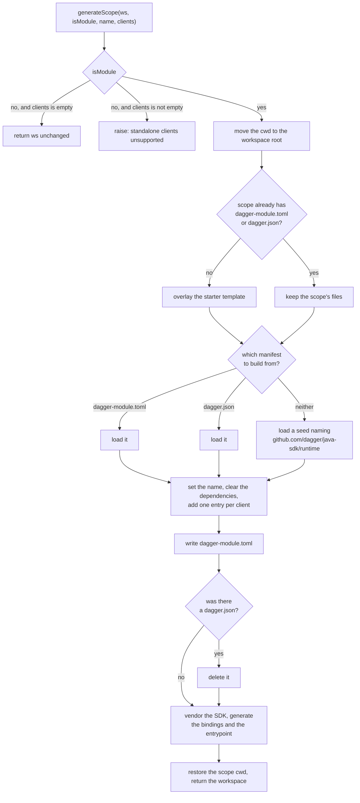

# Adopt the module-max SDK interface

Status: proposed
Date: 2026-09-04

> Superseded in part by `hack/designs/2026-09-13-unified-client-generation.md`,
> which is the separate design this one asked for. Standalone clients are no
> longer refused, and a client's types no longer land in the flat
> `io.dagger.client` package.

## Reviewed baselines

Every claim in this document was checked against these exact revisions.

| What | Revision |
| --- | --- |
| This repository (`dagger/java-sdk`), base of the change | `be18cc2d64951628a79ae7da626ab2427b6a2436` |
| The engine change, `dagger/dagger#13992`, branch `sdk-ux-module-max` | `8fd9b22b5416f8dc7cb420ba37769adef6e874d2` |
| The manifest builder, `github.com/dagger/sdk-helpers`, `main` | `fec4ded81c0565ede1d3bc319d60c985ef95ee84` |
| The reference SDK, `dagger/python-sdk#26` ("Update the Python SDK scope interface"), head | `39550254e0152949cb1d5bcb1dff403110c4b00d` (open) |
| The earlier merged Python adoption, `dagger/python-sdk#25`, head | `c05426e0fbef5d758184667d62ddc406591b8192` (merged as `d8f8eca33c75c1113ba8412b3d3ad626a0c9b0ef`) |
| The released engine and CLI this repository's CI runs | `v1.0.0-beta.11` |

`sdk-ux-module-max` is force-pushed regularly, and it has been force-pushed
twice during this work. Every reference to it below means the commit in this
table, not the branch head at the time of reading. "Tracking the branch" records
what each rewrite changed.

## Problem

`dagger/dagger#13992` changes the contract between the engine and an SDK module.
It ships no compatibility adapter. On an engine built from that change, this
repository's root module cannot serve as the Java SDK at all.

Three removals break it:

- `CurrentModule.asSDK` is gone. `JavaSdk.modules` selects it, so module
  discovery has no source.
- The beta SDK-module interface — `initModule`, `targetRuntime`, and the
  `@generate` hook — is gone. `JavaSdk.initModule`, `JavaSdk.targetRuntime`, and
  `JavaSdk.generateAll` implement exactly that interface.
- `ModuleSource.generateLocalDependencies` is gone. `Mod.generateModule` selects
  it to stage a module's local dependencies before code generation.

The replacement is two required functions and one optional one, declared in
`core/sdkmodule/provider.go`:

- `findClientRoot(ws: Workspace!): String` returns the workspace-relative path
  of the nearest client root that contains the workspace cwd, or null when there
  is none. The result is nullable, and the engine reads it through
  `dagql.Nullable`: an SDK reports "no root here" with null, not with the empty
  string. The empty string would name a root at the workspace root.
- `generateScope(ws: Workspace!, isModule: Boolean!, name: String!, clients: [ModuleSource!]!): Workspace!`
  receives a workspace whose cwd is already the scope, and returns the complete
  scope: the starter template and a module manifest when the scope is new, and
  freshly generated bindings always. The `clients` list becomes the scope's
  dependency set.
- `defaultModulePath(ws: Workspace!, name: String!): String!` is optional. See
  Non-goals.

The engine validates the names, order, and types of those arguments exactly, so
they are not negotiable.

Registration moves with the interface. An SDK is recorded as
`[sdks.<name>] module = "<installed-module-name>"` in `dagger.toml`, and each
managed scope as `[sdks.<name>.scopes."<path>"]`.

Three sibling SDKs have adopted the same interface the same way:
`dagger/python-sdk#25` and its follow-up `dagger/python-sdk#26`,
`dagger/go-sdk#37`, and `dagger/dang-sdk#13`.

## Goals

1. Implement `findClientRoot` and `generateScope`, and delete the beta interface
   they replace.
2. Write a module's `dagger-module.toml` through the shared manifest builder, so
   dependency editing stays out of this repository.
3. Turn a module scope's client list into the module's dependency set, so the
   generated Java bindings carry each client's types.
4. Re-register this SDK under `[sdks.java]`.
5. Migrate a pre-1.0 `dagger.json` module onto `dagger-module.toml`, preserving
   the runtime it already names.
6. Prove the result against a real engine built from `sdk-ux-module-max`, in CI.
7. Leave the pull request's CI green, rather than merging it red as
   `dagger/python-sdk#25` did.

## Non-goals

- **Standalone clients.** A scope with clients but no module (`isModule: false`)
  is refused with an error. This SDK has no mechanism to serve a client outside
  a Java module: every generated binding is vendored under a module's `sdk/`
  directory and compiled by that module's `pom.xml`. `dagger/python-sdk#26`
  refuses the same case for the same reason. Serving standalone clients needs a
  separate design — where the generated code goes, what builds it, what depends
  on it — not a branch in this change.
- **`defaultModulePath`.** The engine's own default for a `dagger module init`
  with no `--path` is `<config directory>/.dagger/modules/<name>`
  (`core/schema/workspace_sdk_module.go`). That is the same convention this
  repository already used, so implementing the hook would only restate it.
- **A public single-module generate entry point.** `dagger generate` regenerates
  the recorded scopes, and the engine narrows that set to the scopes containing
  the caller's cwd, so running it inside a module regenerates that module. A
  separate `dagger call java-sdk mod --path … generate` command shape would be
  new public surface with its own CLI contract to document and test, and the
  engine interface does not need it. `Mod` stays internal.
- **Manifest v2 and generated entrypoints** (`dagger/dagger#14038`). That is a
  different engine change, prototyped separately in `dagger/java-sdk#19`.
- **The unified-clients redesign** (`dagger/java-sdk#17`), which replaces module
  dependencies with generated clients throughout the Java SDK. This change
  adopts one engine interface; it does not redesign the Java client model.
- **Keeping the SDK usable on the released engine.** See "Alternatives
  considered".
- **Changing what generation produces.** The vendored SDK sources, the generated
  bindings, and the generated entrypoint keep their current layout and build.

## Proposed approach

### `findClientRoot`

A Java module always has a `pom.xml` at its root: the starter template writes
one, and the module's build needs one. Nothing else in a generated module is a
project marker. The vendored SDK under `<module>/sdk` is added to the module's
build as extra source roots and carries no `pom.xml` of its own; the optional
committed SDK jar under `<module>/sdk/repo` is accompanied by a `*.pom` file,
which is not named `pom.xml` and so is not a marker either.

So `findClientRoot` answers with the directory of the nearest `pom.xml` at or
above the workspace cwd, as a path relative to the workspace root, and with null
when there is none.

This is the direct analogue of python-sdk's rule — the nearest `pyproject.toml` —
minus the correction python needs. A Python module's vendored client library is
itself an installable Python project with its own `pyproject.toml`, so
python-sdk must lift a hit inside `sdk/` back to the owning module. Java has no
such hit to lift, and `find-client-root-check` pins that: it plants a file
inside a module's `sdk/` tree and asserts the module itself still answers.

Consequences worth stating:

- In a Maven multi-module project, the nearest `pom.xml` wins, so a Dagger
  module nested inside an aggregator resolves to itself, not to the aggregator.
- A Gradle project has no `pom.xml`, so `findClientRoot` returns null and the
  engine reports that client generation is unavailable there. This SDK builds
  modules with Maven; that is the correct answer, and the README says so.

### `generateScope`



`dagger generate` never reaches the `isModule: false, clients empty` branch: the
engine's scope planner skips a scope that is neither a module nor a client
holder (`core/schema/workspace_sdk_generator.go`). The branch exists because
`generateScope` is also callable directly, which is how the end-to-end checks
drive it.

Five properties of that flow are worth stating separately.

**Every module scope is generated.** There is no opt-out. An earlier revision of
this design carried one — a `.dagger-java-sdk-skip-generate` marker file that
held an existing module out of bulk regeneration — and it is gone: the marker,
the `skipGenerateFilename` setting, `Mod.skipGenerate`, the marker fixtures, and
the README section that described it. It existed to keep the end-to-end fixtures
out of `dagger generate`, and the fixtures no longer need it, because no fixture
is registered as a scope any more. Removing it also removes the question of what
a half-generated module means: after `generateScope` returns, a module's
manifest, vendored SDK, and entrypoint are always the ones this run produced.

**The manifest comes from `github.com/dagger/sdk-helpers`.** That module is the
manifest builder, extracted from the engine by #13992; the SDK depends on it,
recorded in both `dagger-module.toml` and `dagger.json` at the repository root,
and reaches it as `sdkHelpers.moduleManifest(loadToml:)` and
`sdkHelpers.moduleManifest(loadJson:)`. The builder parses and serializes both
manifest formats (`tomlFile`, `legacyJSONFile`) and edits dependency entries
(`withLegacyRuntimeDependency`, `withoutLegacyRuntimeDependency`,
`withoutLegacyRuntimeDependencies`). Dependency editing is the part this
repository would otherwise have to implement itself, and the part it must not:
rewriting an existing TOML manifest by hand means parsing and re-emitting a
format the engine owns.

Depending on `sdk-helpers` does not raise this repository's engine floor. That
module declares `engineVersion = "v0.21.9"`, which the released engine
`v1.0.0-beta.11` satisfies, so the dependency does not stop the SDK module from
loading there. This was checked against the module's own `dagger.json`, not
assumed.

**A new module's runtime is named by a seed manifest.** The builder's runtime
setters are one per builtin runtime (`withLegacyJavaRuntime`,
`withLegacyGoRuntime`, …) and they write the builtin short name, so
`withLegacyJavaRuntime` writes `source = "java"` — the engine's own Java runtime.
This SDK targets its own repository's build-and-package-only runtime,
`github.com/dagger/java-sdk/runtime`, for which the builder has no setter.
`sdk-helpers` kept the engine's rule: a non-builtin runtime is rejected on a
manifest built from nothing and accepted on one loaded from a config file. So
`seedManifestFile` renders a three-key `dagger-module.toml` — the module name,
the live engine version, and the runtime source — as a `File`, and
`scopeManifest` loads that file through the builder. What lands on disk is
therefore the builder's own rendering, not the seed bytes.

**Clients become dependencies.** In a module scope, the complete client set
replaces the module's dependency list: the manifest's dependencies are cleared
structurally with `withoutLegacyRuntimeDependencies`, then one entry is added
per client — a git client by its ref as is, a local client by its path relative
to the module, computed with `Path(...).relativeTo(...)`. Clearing by name would
not do. `withoutLegacyRuntimeDependency` matches an unnamed dependency on its
*source*, and reading the recorded names means selecting
`ModuleSource.dependencies`, which resolves every one of them, so a single stale
or unreachable entry would fail generation instead of being dropped. Because the
Java bindings are generated from the module's introspection schema, and that
schema includes its dependencies' types, this is all it takes for a client's
types to appear in the generated bindings.

**A module with dependencies and no clients loses those dependencies.** That is
the contrapositive of the rule above, it is deliberate, and it is the module-max
model: the client set *is* the dependency set. It is also a real migration
hazard, because the engine's own config migration records only `is-module` and
`name` on a scope and never seeds `clients` from an existing dependency list
(`core/workspace/migrate.go`). A module that has dependencies today therefore
needs each of them re-registered as a client before the first `dagger generate`
under the new interface. The README says so, and `generate-scope-clients-check`
pins the behaviour.

**Generation runs with the cwd at the workspace root.** The engine resolves a
module's local dependency to a workspace-root-relative path and then reads it
relative to `Workspace.cwd` (`ResolveDepToSource` in `core/modulesource.go`).
With the cwd at the scope, as it is on entry to `generateScope`, a dependency
`../../dep` of `mods/app` is looked up under `mods/app/../../dep` resolved from
`mods/app` — the wrong place. Moving the cwd to the workspace root for the work
and restoring the scope cwd on the result avoids it. The engine requires the
restore in any case: it rejects a `generateScope` result whose cwd is not the
scope.

### Migrating a pre-1.0 module

A module configured by `dagger.json` is migrated the first time it is generated.
Its `dagger.json` is loaded through the builder, the resulting manifest is
written as `dagger-module.toml`, and the `dagger.json` is then deleted. The two
files never coexist, so they cannot disagree.

The migration preserves the runtime the module already names. A module on the
engine's builtin `java` runtime stays on it and does not silently move onto
`github.com/dagger/java-sdk/runtime`; the seed manifest is used only when the
scope has no manifest at all. `generate-scope-migrate-check` asserts exactly
that: the `dagger-module.toml` it produces still carries `source = "java"`.

### What survives from `mod.dang`

`Mod` holds everything that is not part of the engine interface: the Maven
codegen containers, the vendored SDK build, the entrypoint compilation, and the
module-relative path arithmetic. None of it is touched by #13992 and all of it is
kept.

The changes needed there:

- `Mod.generateModule` selects the removed `ModuleSource.generateLocalDependencies`
  to stage local dependencies before reading the module's introspection schema.
  The engine now generates scopes in dependency order itself, so the staging
  step is removed rather than replaced.
- `generateScope` must return a `Workspace`, not a `Changeset`. `Mod` gains
  `generated: Workspace!` — the workspace with this module's generated files
  merged in, mirroring python-sdk — and `generate: Changeset!` is deleted rather
  than rewritten, because nothing else called it. `Mod.path` goes with it.
- `Mod` took `ws` both as a constructor field and as an argument to `generate`.
  The argument goes away, so `Mod` has one workspace.
- `skipGenerateFilename` and `skipGenerate` are deleted with the skip marker.
- The unused `defaultModulePath` and `cleanModulePath` helpers, both left over
  from the beta init contract, are deleted.
- The Maven repository cache volume is mounted `LOCKED` rather than shared.
  Seeding it from the committed prebuilt repository is a plain recursive copy,
  and two generations running at once race on it —
  `cp: cannot create directory ...: File exists`. Generating two Java modules
  concurrently is ordinary, so the mount serializes rather than the callers.

`generateScope` constructs `Mod` directly from the scope the engine handed it.
Nothing needs to read the registered scope list, so this SDK never selects
`Workspace.sdk`. python-sdk does, because it keeps a public `mod` that resolves
a module by path; the corresponding fragility — the lookup keys on the SDK's
*install* name in `dagger.toml`, not on its SDK name — does not arise here.

### Registration

`dagger.toml` at the repository root gains:

```toml
[modules.java-sdk]
source = "."
check.skip = ["*"]

[sdks.java]
module = "java-sdk"
```

`[modules.java-sdk]` is required, not decorative: the engine rejects a
`[sdks.<name>]` entry whose `module` is not an installed module. `check.skip`
keeps a released-engine `dagger check` from calling into a module that engine
cannot serve.

No fixture is registered as a scope. The end-to-end fixtures used to carry their
own nested workspace config, `.dagger/modules/e2e/fixtures/dagger.toml`, and an
intermediate revision of this change moved them into
`[sdks.java.scopes."<path>"]` blocks in the root `dagger.toml`. Both are gone.
The checks build the scopes they drive in memory instead, so there is nothing
for `dagger generate` to walk into and nothing to hold out of it.

Two registrations go away:

- `[modules.sdk-sdk]` and the checks it contributes. `github.com/dagger/sdk-sdk`
  validates the beta contract this change removes: it asserts that `initModule`
  seeds files without writing config, that `dagger sdk install` writes an
  `as-sdk` marker, that `dagger module deps list` works. Every one of those
  statements is false after this change. `dagger/python-sdk#25` dropped the same
  dependency.
- `[modules.e2e]`. The end-to-end module is no longer installed at all; see
  "Two engines, two check sets".

One registration deliberately stays: `[modules.dagger-dang-sdk.as-sdk]`, which
registers this repository's own Dang modules (the root module and
`.dagger/modules/templates`) with the Dang SDK.

An earlier revision of this design removed it, reasoning that `as-sdk` is
removed by #13992, that dang-sdk has not adopted the replacement
(`dagger/dang-sdk#13` is open), and that silently ignored configuration is worse
than none. That was wrong, and CI said so. dang-sdk's generator fails outright
when it finds no registration — `current module is not installed as an SDK in
this workspace` — rather than reporting an empty module set, so removing the
table turns `dagger-dang-sdk:generate` red. The module-max engine ignores the
table, because its config parser ignores unknown keys, so keeping it costs
nothing there. It comes out when dang-sdk adopts the new interface and can be
registered under `[sdks.dang]` instead.

## Testing

### What the released engine can and cannot do

Every check in `.dagger/modules/e2e` calls into this SDK module, and this SDK
module implements an interface the released engine `v1.0.0-beta.11` does not
have. Those checks therefore run only in an engine built from
`sdk-ux-module-max`.

Which symbol stops it has moved as the branch moved, so it is worth naming what
was measured rather than repeating an older cause. On `v1.0.0-beta.11`,
`dagger call java-sdk find-client-root --ws .` fails with
`field "withFile" not found in Dagger.Workspace`: `generateScope` writes the
manifest through `Workspace.withFile` and removes a migrated `dagger.json`
through `Workspace.withoutFile`, and that engine has neither. An earlier
revision of this design named the engine's builtin `moduleManifest` instead;
that symbol is no longer selected at all, because the builder moved to
`sdk-helpers`, which the released engine loads happily.

An earlier revision of this design gated them with `check.skip` instead, and
measured that the gate was sufficient. On `v1.0.0-beta.11`, in a scratch
workspace with two Dang modules where module `ok` depends on module `bad`, and
`bad` has one function selecting a symbol the engine does not have:

- the workspace loads and `dagger check` enumerates every check;
- `ok:independent`, which does not touch `bad`, passes;
- `ok:touches-bad`, which selects one unrelated field of `bad`, fails;
- with `check.skip = ["*"]` on the module that owns a failing check, the run is
  green.

Two conclusions from that measurement still hold. A failing selection anywhere
in a Dang module poisons every call into it, because Dang infers a whole program
on each call. And `check.skip` suppresses only the `checks` resolver, so
`dagger call` is unaffected by it — which is why `[modules.java-sdk]` can carry
`check.skip = ["*"]` and still serve as the `java` SDK.

The `e2e` module went further and is not installed in `dagger.toml` at all. An
uninstalled module is never enumerated, so no skip list has to keep up with the
checks it holds, and no future check can be added outside the gate by accident.
`engine-e-2-e:sdk-contract-check` loads it by path instead.

`dagger/python-sdk#25` had no equivalent gate. Its merged head
(`c05426e0fbef5d758184667d62ddc406591b8192`) carries 19 commit statuses, of
which 11 are red: every `e-2-e:*` check that calls the python-sdk module. It has
one green development-engine check, `engine-e-2-e:dev-sdk-check`, an
initialization smoke test. Its remaining new-interface checks were run by hand
in a development engine and are not covered by CI at all.

### Two engines, two check sets

| Where | Engine | What it covers |
| --- | --- | --- |
| `packager:*`, `templates:generate`, `dagger-dang-sdk:generate` | released, `v1.0.0-beta.11` | the SDK library build, its unit tests, the prebuilt assets, the templates |
| `engine-e-2-e:*` | built from `sdk-ux-module-max` at `8fd9b22b5416f8dc7cb420ba37769adef6e874d2` | the whole `findClientRoot` / `generateScope` contract |

`.dagger/modules/engine-e2e` depends on
`github.com/dagger/dagger/.dagger/modules/engine-dev`, builds the engine from
the pinned commit, and runs it as a playground container with this checkout
mounted inside.

`engine-e-2-e:dev-sdk-check` is the deliverable, and mirrors python-sdk's:

1. `dagger sdk list` reports `java`. This proves the registration parses; it
   loads no module, so it proves nothing more.
2. `dagger module init java --name … --path …` succeeds. This is the check that
   proves the interface: it loads the SDK module, validates its function
   signatures against `core/sdkmodule/provider.go`, and calls `generateScope`.
   It then asserts the files that call produced — the `dagger-module.toml`, the
   absence of a `dagger.json`, the `pom.xml`, the module class, the vendored
   bindings, and the generated entrypoint — and that the manifest names
   `github.com/dagger/java-sdk/runtime`.
3. `dagger call` against the initialized module proves the generated module
   builds with Maven and serves its API.

`engine-e-2-e:sdk-contract-check` runs the end-to-end checks inside the same
playground, as a single `dagger -m .dagger/modules/e2e check`. Running the whole
module in one invocation, rather than a list of per-check `dagger call`
invocations, means a check added to `.dagger/modules/e2e` is covered without
touching `engine-e2e`. This is coverage `dagger/python-sdk#25` does not have. It
is also the expensive part: the playground engine starts with cold Maven caches,
and this SDK installs its jars under a per-module Maven version on purpose, so
two scopes with different module names share no build.

The end-to-end checks are:

| Check | Asserts |
| --- | --- |
| `find-client-root-check` | the nearest `pom.xml` wins; a nested directory resolves to its module; a directory inside a module's vendored `sdk/` resolves to that module; a module of another SDK with no `pom.xml` gives null; the workspace root gives null |
| `generate-scope-init-check` | a config-less scope gets the template, a `dagger-module.toml` naming this repository's runtime, the vendored bindings, and the entrypoint; no `dagger.json` is written; existing files survive; nothing is modified or removed; the cwd is unchanged; regenerating the result changes nothing |
| `generate-scope-migrate-check` | a module whose manifest is a pre-1.0 `dagger.json` gets a `dagger-module.toml` carrying the runtime it already named, and the `dagger.json` is removed |
| `generate-scope-clients-check` | a client is recorded as a dependency in the manifest and its type appears in the generated bindings; dropping the client removes it from both; a scope with no module is untouched; a standalone client raises |
| `nullable-return-check` | a module function returning `Optional<Directory>` registers an optional return type and unwraps the `Optional` before serialization |

Those checks build their scopes in memory from the starter template rather than
from committed stubs. With generation always on, a scope a check drives has to
be a module Maven can build, and a config-only stub is not one. They also share
a single module name wherever they need only *a* module, because a second name
costs a second vendored SDK build.

That cost was measured rather than guessed, on a developer machine with a warm
outer engine. `engine-e-2-e:dev-sdk-check` passes against
`8fd9b22b5416f8dc7cb420ba37769adef6e874d2` in 2m27s with warm caches; earlier
cold runs of the same check took 5–8 minutes.
`engine-e-2-e:sdk-contract-check` was last measured against an earlier pin and
an earlier check set, at 7m16s on a first full pass and 3m29s once the vendored
SDK build was cached; it has not been re-measured against the check set above.
CI starts colder than any of these figures and will be slower; they bound the
shape of the cost, not its exact value.

Client handling stays inside Dang throughout: the checks call
`javaSdk.generateScope(...)` and diff the result, and never go through
`dagger module client add`. That CLI command is broken on `sdk-ux-module-max` —
it loses the workspace overlay on reload and silently writes nothing, on every
SDK — and the fault is in the CLI (`internal/cmd/dagger/module_sdk.go`), not in
any SDK's `generateScope`. python-sdk's checks avoid it the same way.

### Known gaps

One behaviour ships unchecked, deliberately: `dependencySource`'s `GIT_SOURCE`
arm. Recording a git client by its ref as is is not exercised by any check,
because a git `ModuleSource` needs a real remote, which no check here can
produce hermetically.

An earlier revision of this design listed a second gap — no full generation of a
pre-1.0 `dagger.json` module — because the fixture that drove the `loadJson`
manifest branch sat under the skip marker and never reached Maven.
`generate-scope-migrate-check` closes it: it generates a real module, replaces
its manifest with a `dagger.json`, and generates again.

### The engine pin

Both the `engine-dev` dependency and the engine source name a commit of
`sdk-ux-module-max`, so CI does not float with a branch that force-pushes.
Following the branch means bumping both, plus `dagger.lock`.

`github.com/dagger/sdk-helpers` is depended on without a pin, so it resolves to
whatever its `main` is when the SDK module is loaded.

## Tracking the branch

`sdk-ux-module-max` was force-pushed twice while this change was being written,
and each rewrite moved the interface under it. A reader should treat the pinned
commit as a moment in time, not as the definition of the contract.

**`78c241b6` → `7e6fc93c`.** Two renames, not a re-pin. `detectScope` became
`findClientRoot`, and its result became nullable: the engine reads it through
`dagql.Nullable` and treats an invalid result as absent, so the previous
convention of reporting "no root here" with the empty string would have named a
root at the workspace root. The manifest builder's dependency verbs became
explicit about whose dependencies they are: `withDependency`,
`withoutDependency`, and `withoutDependencies` became
`withLegacyRuntimeDependency`, `withoutLegacyRuntimeDependency`, and
`withoutLegacyRuntimeDependencies`, matching the `LegacyRuntimeDependencies`
field they write. `generateScope`'s signature and the `[sdks.<name>.scopes]`
config shape were unchanged.

**`7e6fc93c` → `8fd9b22b`.** The manifest builder left the engine. `moduleManifest`
is no longer a builtin; it lives in a separate Dang module,
`github.com/dagger/sdk-helpers`, which every SDK adopting this interface now
depends on. The builder's API is otherwise the same, including the rule that a
non-builtin runtime is accepted only on a manifest loaded from a config file.
`generateScope`'s signature and the `[sdks.<name>.scopes]` config shape were
again unchanged.

## Alternatives considered

**Keep the SDK usable on the released engine.** `generateScope` could render
`dagger-module.toml` as a string instead of going through the manifest builder,
and the module would keep working on `v1.0.0-beta.11`. Rejected: replacing the
complete dependency set of an *existing* manifest means parsing and rewriting
TOML, which Dang cannot do and which would put manifest editing back into this
repository. Seeding a manifest is a different matter — the seed for a *new*
module is hand-rendered TOML, because the builder has no setter for this SDK's
runtime — but a fixed three-key seed is not a TOML editor. The other three SDKs
all take the builder.

**Regenerate the manifest from scratch instead of loading it.** `dagger/dang-sdk#13`
builds each manifest from a fresh builder and does not merge existing content,
for deterministic output. Rejected here: a Java module's manifest can carry
`include` paths and settings that this SDK did not write and has no business
dropping.

**Leave a pre-1.0 `dagger.json` in place next to the new `dagger-module.toml`.**
Rejected: two manifest files for one module can disagree, and nothing would say
which one wins. Migrating the contents across and deleting the `dagger.json`
makes the module single-sourced again in one step.

**Keep a skip marker for opting a module out of generation.** Rejected: its only
consumer was the end-to-end fixture tree, and that tree is no longer registered
as scopes, so the marker protected nothing while adding a second way for a
module's generated state to be stale.

**Migrate the Dang SDK registration to `[sdks.dang]` at the same time.** It
would replace the `as-sdk` table this change keeps. Rejected: it names dang-sdk
as the provider of an interface dang-sdk does not implement yet, so it would
fail on the very engine it is meant to serve. Removing the table outright was
tried and rejected too — see Registration.

**Use `withLegacyJavaRuntime` and accept the engine's builtin `java` runtime.**
Rejected: it would silently move every newly created module off this
repository's runtime and onto the engine's, undoing the self-contained layout
that is the point of this SDK.

**Gate the end-to-end checks with `check.skip` rather than uninstalling the
module.** Rejected: the module has no check that a released engine can run, so
the skip list would always be `["*"]`, and an uninstalled module says the same
thing without a list to maintain. This repository has no CI configuration of its
own, so an explicit include list (`dagger check packager:* templates:*`) was not
available either — the `dagger check` invocation is not ours to change.

## Affected components

| Path | Change |
| --- | --- |
| `main.dang`, `main.dang.tmpl` | `findClientRoot`, `generateScope`, `scopeManifest`, `seedManifestFile`, `dependencySource`; `initModule`, `targetRuntime`, `modules`, `generateAll`, `skipGenerateFilename` removed |
| `mod.dang` | `generated: Workspace!`; local-dependency staging removed; single workspace field; skip-marker and dead init helpers removed; `LOCKED` Maven cache mount |
| `dagger-module.toml`, `dagger.json` | the `github.com/dagger/sdk-helpers` dependency |
| `dagger.toml` | `[modules.java-sdk]`, `[sdks.java]`, `[modules.engine-e2e]`; `[modules.sdk-sdk]` and `[modules.e2e]` removed, the dang-sdk `as-sdk` table kept |
| `dagger.lock` | the `engine-dev` dependency closure |
| `.dagger/modules/e2e/main.dang` | checks rewritten against the new interface, driving scopes built in memory |
| `.dagger/modules/e2e/fixtures/**` | `lookup/app` (with `pom.xml` and `nested/`), `lookup/not-java`, `clients/dep`; the config-only stubs and the skip markers removed |
| `.dagger/modules/engine-e2e/` | new: builds the branch engine and checks against it |
| `README.md` | new command shapes, the module-scope model, the dependency migration step, the pre-1.0 migration |

## Risks

- **Existing modules lose their dependencies on the first generate.** Described
  under "Clients become dependencies" above. Mitigated by a README migration
  step and a check, not by code: re-deriving clients from an existing dependency
  list is the engine's migration to make, not this SDK's.
- **The branch moves.** `sdk-ux-module-max` force-pushes, twice already during
  this work. The pin makes CI reproducible, but it also means the checks
  validate a commit, not the branch head. A later engine change can break this
  SDK without CI noticing until the pin is bumped.
- **`sdk-helpers` moves too, and is not pinned.** The dependency records no
  `pin`, and `dagger.lock` records no commit for it, so a change to its `main`
  reaches this SDK without a commit here. Pinning it is the obvious mitigation
  and is not done.
- **Nested Java builds are slow.** The `engine-e2e` checks run Maven inside a
  development engine inside the outer engine, with cold caches. Java code
  generation is the heaviest operation this repository has. A check added later
  that generates under a *new module name* pays for a whole vendored SDK build
  of its own, because this SDK installs its jars under a per-module Maven
  version on purpose; re-measure when one is added.
- **The seed-manifest path depends on a validation detail.** Loading a config
  file is what lets a non-builtin runtime through the builder's validation. If
  `sdk-helpers` later rejects non-builtin runtimes outright, new Java modules can
  no longer name `github.com/dagger/java-sdk/runtime`, and this SDK needs a
  builder API for an arbitrary runtime source. That is worth raising on #13992
  independently of this change.
- **`dagger module client add` is broken on the branch.** Client handling is
  therefore verified at the API level only. When the CLI is fixed, the
  playground checks should drive it end to end.
- **Standalone clients are refused.** A user who runs `dagger module client add`
  from a directory that is not a Java module gets an error rather than a
  generated client. This matches python-sdk, and is the honest answer while the
  Java SDK has nowhere to put such a client.

## What shipped

Four commits on top of `be18cc2d64951628a79ae7da626ab2427b6a2436`, then two
rounds of tracking the branch. Each commit leaves the tree in a state that
loads, and none of them registers a module whose source does not yet exist.

1. **`java-sdk: implement the module-max SDK interface`.** The interface cutover
   is one commit because its parts cannot be separated: the moment `main.dang`
   drops `initModule`, the end-to-end module that calls it stops compiling.
   `main.dang` and `main.dang.tmpl` — kept identical apart from the template
   placeholder — lose `targetRuntime`, `initModule`, `modules`, and
   `generateAll`, and gain `findClientRoot`, `generateScope`, the
   `template: String! = "default"` constructor setting that replaces
   `initModule`'s `template` argument, and the private manifest helpers.
   `mod.dang` gains `generated: Workspace!` and loses the local-dependency
   staging, the duplicated workspace argument, and the dead init helpers. The
   root `dagger.toml` gains `[modules.java-sdk]` and `[sdks.java]` and loses
   `[modules.sdk-sdk]`. The end-to-end checks are rewritten against the new
   interface.
2. **`e2e: check the SDK against an engine built from sdk-ux-module-max`.** Adds
   `.dagger/modules/engine-e2e`, its `[modules.engine-e2e]` registration, and the
   regenerated `dagger.lock`.
3. **`README: document the module-scope model`.** Rewrites the install, create,
   generate, and client sections around `dagger module install`,
   `dagger module init java --name … --path …`, and `dagger generate`, and states
   the migration obligations.
4. **`workspace: keep the dang-sdk as-sdk registration`.** Restores the
   `[modules.dagger-dang-sdk.as-sdk]` table an earlier revision removed, after
   `dagger-dang-sdk:generate` failed without it.

Then, tracking `sdk-ux-module-max`:

5. **`java-sdk: track sdk-ux-module-max after its force-push`.** Adopts
   `findClientRoot` and its nullable result, and the renamed dependency verbs;
   re-pins the engine to `7e6fc93c`.
6. **The move to `8fd9b22b`.** Adopts the `github.com/dagger/sdk-helpers`
   dependency in place of the removed engine builtin, always writes the manifest
   and migrates a pre-1.0 `dagger.json`, deletes the skip marker and everything
   that referenced it, replaces the hand-rolled path arithmetic with
   `Path(...).relativeTo(...)`, uninstalls the `e2e` module in favour of
   `dagger -m .dagger/modules/e2e check`, and rebuilds the fixtures and the check
   set around always-on generation.

Verification: `dagger check` on the released engine for the ungated checks,
`engine-e-2-e:dev-sdk-check` and `engine-e-2-e:sdk-contract-check` against the
pinned engine. This document moves to `hack/designs/done/` once that run is
green, together with `hack/designs/2026-08-17-nullable-object-returns.md`, which
is implemented but still reads as proposed and still describes verification
through `generateAll` and `sdk-sdk:*` — both of which this change removes, and
both of which `nullable-return-check` replaces.
