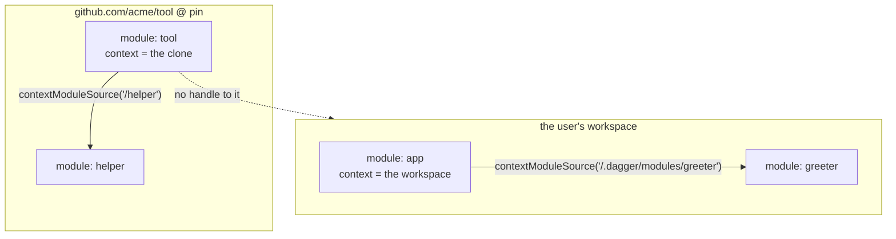

# Asking the engine for a client's module

Status: proposed
Date: 2026-09-15
Scope: an engine change, proposed from the consumer side. Not part of
`dagger/java-sdk#23`.

## Terms

**Client** — a module that generated code talks to, declared in `dagger.toml`
under an SDK scope's `clients`. The declaration is what causes the bindings to
be generated. It is a *generation-time* input.

**Serve** — make a module's fields resolvable in a session, so `dag.<name>`
exists. Until something serves, the field is absent and a query naming it fails.

**Context** — a `ModuleSource`'s `contextDirectory`: the full directory loaded
for that module, with the module itself at `sourceRootSubpath` inside it. For a
module in a workspace this is the git root; for a git module it is the clone.

## Requirements

1. **Generated code is self-sufficient.** Once bindings exist, they load their
   module on their own terms. Deleting the SDK registration, or the scope, or
   the `clients` list must not stop committed code from running. Generated code
   is code; it does not consult build configuration at run time any more than a
   compiled binary re-reads its dependency manifest.
2. **A module cannot reach the caller's workspace.** `dagger/dagger#14148`: a
   transitively-loaded dependency can currently obtain `currentWorkspace` and
   enumerate the user's workspace root.
3. **No `[[dependencies]]`.** Manifest v2 removes it.
4. **One code path.** The same generated call inside a module and outside one.

Requirements 1 and 2 are the hard pair. A self-sufficient client carries a
descriptor, and a descriptor is not a capability — anything that can hold one
can forge one. Resolving a forged path is precisely the hole.

## The resolution

Do not ask *who is allowed to name this path*. Ask *whose filesystem the path is
interpreted against*.

A module already owns a context directory, and it is wider than the module: it
is the tree the module was loaded from, with siblings in it. The engine holds
that context for every loaded module and never hands it over wholesale.

So a module may name a path, and the engine resolves it **in the calling
module's own context** — never in the caller-of-the-caller's workspace.

| caller | its context | so a path names |
| --- | --- | --- |
| the user's own module | the user's workspace | the user's own modules |
| a git dependency | its own clone, at its pin | modules in its own repository |
| a standalone program | its workspace | its own workspace |

A third-party dependency is confined to itself, structurally: it holds no handle
to the user's workspace, so there is no path it can write that reaches one. The
refusal is not a check standing in front of a capability — the capability is not
there to check.

And the field grants nothing new. A module's own context is already its own; the
engine simply interprets a path against it and loads a module. No `directory`,
no `file`, no `export`, no way to walk sideways into them.

## Proposal

```graphql
extend type Query {
  """
  A module at a path in the caller's own source context.
  """
  contextModuleSource(path: String!): ModuleSource!
}
```

Present in **both** the module-facing and client-facing schemas. Resolution root:

- **Module session** — the calling module's `ModuleSource.contextDirectory`. The
  engine created the session and holds the source; the caller asserts nothing
  about which context is used.
- **Client session** — the caller's workspace, which it already reaches through
  `currentWorkspace`. No new capability for clients at all.

Paths are clamped to the context, as workspace paths already are.



A git client needs none of this: `moduleSource(refString:, refPin:)` is already
self-sufficient, already works in both session kinds, and is unchanged.

### What the SDKs do

The client package keeps the descriptor it already carries, and serves once per
session on first use:

```
contextModuleSource(path: "/.dagger/modules/greeter").asModule().serve()
```

For the Java SDK this is a one-line change in `ModuleTargets`: the local branch
swaps `currentWorkspace.moduleSource(path)` for `contextModuleSource(path)`, and
`servesWorkspacePaths` goes away because the answer is now yes everywhere. The
descriptor, the pin and the git/local split all stay exactly as they are, which
is the point — they are what makes the bindings stand on their own.

### What it does for #14148

It supplies the sanctioned route the issue says must exist before
`currentWorkspace` can be gated for module sessions, and it answers the question
the issue leaves open — whether the top-level module differs from a dependency —
with **no**. They run the same rule against different contexts. The top-level
module's context is the user's workspace because it *is* the user's code; a
dependency's context is its own source because that is what it is.

## Alternatives considered

**Look the client up by name in `dagger.toml`.** Proposed first, and wrong. It
makes generated code depend on build configuration at run time: delete the SDK
registration or the `clients` list and committed, compiled code stops working.
It also breaks any client that travels. Self-sufficiency is not a nice-to-have
here — the bindings are an artifact, and an artifact that silently depends on
the config that produced it is not one.

**Serve a scope's clients automatically when the engine creates the session.**
The closest thing to what `[[dependencies]]` did, and needs no new schema at
all. Rejected for being eager — one unresolvable client breaks every other one
and the module with them — and for the same self-sufficiency reason: it is the
workspace config doing the work, not the code.

**A capability token baked in at generation time.** Unforgeable, self-sufficient,
and the theoretically right answer. Rejected because making it unforgeable needs
signing and key management in the engine; a content digest avoids the secret but
changes on every source edit, so local development would invalidate bindings
continuously. Resolving in the caller's own context gets the same confinement
with no new machinery.

**Gate `currentWorkspace` for modules and stop there.** Fixes the hole, breaks
the legitimate case, leaves the SDKs with nothing. The option `#14148`
explicitly warns against.

## Security model

**The asset is the user's filesystem.** A module can already run containers,
reach the network and execute arbitrary code; loading another module is not a
privilege escalation for something that can already do all three. What a module
must not have is the user's files, which is what `currentWorkspace` hands over
and what step 3 below closes.

**Chains do not amplify.** `Module.serve` is a per-session schema mutation, so a
dependency that serves something mutates its own schema and not its caller's —
the reason the TypeScript dispatcher has to serve into its own session rather
than the spawner's. Combined with per-context resolution, a dependency three
hops down reaches its own context and nothing else. Depth buys nothing.

**This opens no new door.** A module can already serve an arbitrary module from
code today:

```graphql
{ moduleSource(refString: "github.com/somewhere/thing@v1") { asModule { serve } } }
```

No workspace, no configuration, no declaration. Loading initiated from code and
invisible in config is the status quo. `contextModuleSource` adds a strictly
narrower form of it.

### What does change, and it is worth naming

A declaration in `[[dependencies]]` was **authoritative**: the engine enforced
it, so the set in the manifest was the set. A descriptor in generated code is
**descriptive**: it records what the generator emitted, and nothing stops
hand-written code from loading more. The set remains statically visible — the
client packages are committed, and listing them gives it — but "this module may
not load anything new" stops being a statement that can be enforced.

That is manifest v2's doing rather than this design's, and this design does not
restore it. Two separable answers, neither of which reintroduces a run-time
configuration lookup:

1. **For auditability**, have the SDK emit a generated, committed record of the
   client set: diffable, greppable, and readable by supply-chain tooling.
   Descriptive metadata, explicitly not an authorization input. This recovers
   the property a manifest gave without making generated code depend on
   configuration to run.
2. **For enforcement**, if it is ever wanted, policy belongs at the workspace or
   session level — modules loaded here may only load from these registries —
   rather than in a per-module manifest. Orthogonal to this design and composes
   with it.

### Vendored third-party code

A third-party module vendored into the user's workspace shares the user's
context, so it can name modules there. It is still confined to loading them and
gets no file access. This is not treated as a gap: vendoring third-party code
into your own tree is a decision to run it beside your files, and the
responsibility sits with whoever vendored it. A module reached by git ref, which
is the ordinary case, is confined to its own clone.

## Migration

1. Add `contextModuleSource(path:)` to both schemas, version-gated. Purely
   additive; nothing changes behaviour.
2. Move each SDK's serve onto it — the TypeScript dispatcher's
   `currentWorkspace { moduleSource(path:) }`, and the Java SDK's
   `ModuleTargets`.
3. Gate `currentWorkspace` in the schema served to module sessions, and land it
   as the fix for `#14148`.

Steps 1 and 2 are additive and stand on their own merit. Step 3 is the security
fix and depends on them.

## Open questions

- **The name.** `contextModuleSource` echoes `contextDirectory`, which is what
  it resolves against. `ownModuleSource` and `localModuleSource` were the other
  candidates; the second is misleading, since a git module has a context too.
- **Does a module ever need a *wider* context?** A module whose client sits
  outside its own git root has no path to it. Believed not to arise — a client
  is either in the same tree or reached by git ref — but not proven.
