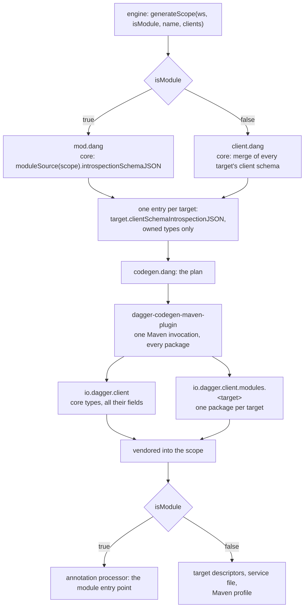
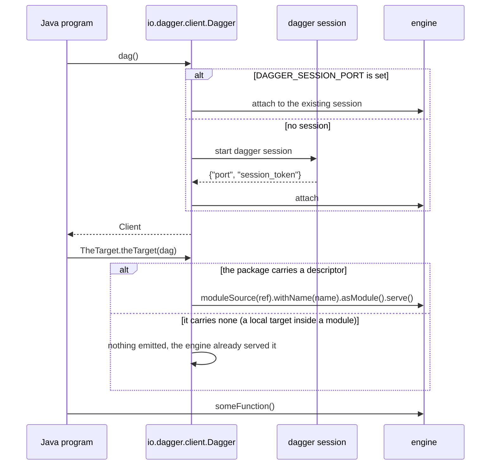

# Unified client generation

Status: implemented
Date: 2026-09-13

## Terms

This document uses one word per concept.

| Term | Meaning |
| --- | --- |
| **target** | A Dagger module that Java code calls. |
| **scope** | A directory the SDK generates into. A *module scope* holds a Dagger module. A *standalone scope* is an ordinary Maven project that only calls targets. |
| **bindings** | The generated Java code. |
| **client package** | `io.dagger.client.modules.<target>`, holding one target's bindings. |
| **target descriptor** | The generated record of one target's name, reference and pin, used to serve it. |

The engine and its configuration use "client" for what this document calls a
target: `dagger module client add java <ref>` records a target, and
`[sdks.java.scopes."<path>"].clients` holds them. Where this document quotes an
engine name it keeps the engine's spelling.

## Reviewed baselines

Every claim below was checked against these exact revisions.

| What | Revision |
| --- | --- |
| This repository (`dagger/java-sdk`), base of the change | `24f430a529a5aa07b0d3ca64417d8f460394f004` |
| The engine (`dagger/dagger`), `main` | `7c35e6274737acff0f6bd76614abb5e04efa7d12` |
| The released engine and CLI the checks run against | `v1.0.0-beta.13` (`6bf59d50`) |
| The engine the `engine-e2e` module builds today | `8fd9b22b5416f8dc7cb420ba37769adef6e874d2`, a pre-merge commit of `dagger/dagger#13992`, **not** an ancestor of `7c35e627` |
| The SDK-module interface, `dagger/dagger#13992` | merged 2026-09-09 |
| The client-codegen schema primitives, `dagger/dagger#13646` | merged 2026-07-16 |
| Manifest v2 entrypoints, `dagger/dagger#14038` | **open, unmerged** — nothing here depends on it |
| The manifest-v2 prototype in this repository, `dagger/java-sdk#19` | open, unmerged — nothing here depends on it |
| This work's own pull request, `dagger/java-sdk#17` | the unified-clients redesign named as a non-goal by the design at `hack/designs/2026-09-04-sdk-module-interface.md` |
| The reference standalone-client implementation, `dagger/typescript-sdk#42` | merged |
| The reference per-target emitter, `dagger/python-sdk#22` | open draft, built on an SDK interface the engine no longer has |

An earlier attempt at this feature in this repository was abandoned. Its tip is
`848fc622b4c83dc16e226e802f17c76f66c2cf3b`, on the branch `module-max` of the
fork `github.com/eunomie/java-sdk`. Parts of it are reused. The section
**What was taken from the abandoned attempt** lists every commit by full hash.

## Problem

A Dagger module written in Java can call another module. This repository already
generates the Java bindings for that: `dagger module client add java <ref>`
records the target, `dagger generate` writes the bindings into the calling
module's vendored SDK, and the module's code calls `theTarget()` after one
import.

A plain Java program cannot do the same thing. `dagger module client add java`
in a Maven project that is not a Dagger module is refused. `main.dang` raises
`java-sdk does not generate standalone module clients yet`. Two separate things
are missing.

1. **Generation.** Nothing produces bindings for a scope that has no module.
2. **Runtime.** `io.dagger.client.engineconn.Connection` reads
   `DAGGER_SESSION_PORT` and `DAGGER_SESSION_TOKEN` and throws when they are
   absent. It cannot start a session. It also accepts a `loadWorkspaceModules`
   parameter and ignores it. So even with bindings in hand, a plain
   `java -jar app.jar` cannot reach an engine, and nothing asks the engine to
   load the target.

There is a second problem in the case that does work. Every type in the schema —
the engine core API and every target's types — is generated into one flat Java
package, `io.dagger.client`. The content of that package therefore depends on
the whole target set. A module with targets `{alpha}` and a program with targets
`{alpha, beta}` get different files for `alpha`. The bindings for a target are
not a stable artifact. They are a by-product of whoever is calling.

## Goals

- One Java program, module or not, reaches a target through the same bindings.
- A target's client package is byte-identical wherever it is generated, and does
  not change when an unrelated target is added or removed.
- A plain Java program can open an engine session and reach its targets with no
  Dagger CLI wrapper command.
- One code path generates a client package. The module scope and the standalone
  scope differ only in the schema they hand that path and in what they emit
  alongside it.

## Non-goals

- **Downloading the Dagger CLI.** The runtime will start a session from a
  `dagger` binary it finds. It will not fetch one. Provisioning is a separate
  concern with its own release, checksum and mirror questions.
- **Publishing the Java SDK to a Maven repository.** The SDK stays vendored as
  source, as it is for modules today.
- **Generating a client package for the module's own types.** See
  **Alternatives considered**.
- **Manifest v2.** `dagger/dagger#14038` and `dagger/java-sdk#19` are unmerged.
  Nothing here uses either.
- **Build tools other than Maven.** A Java scope is a directory with a
  `pom.xml`; `findClientRoot` in `main.dang` already says so. Gradle is out of
  scope.
- **Choosing a target at run time.** Bindings are typed, so the set of targets
  is fixed when the code is generated. The engine loads a recorded target when
  the program first needs it. The program cannot invent a reference at run time.

## What the engine already provides

These facts decide the design. Each was read in the engine source at
`7c35e6274737acff0f6bd76614abb5e04efa7d12`.

**`ModuleSource.clientSchemaIntrospectionJSON` is the unit of client
generation.** It returns an introspection schema holding the client-facing core
API plus exactly one module, installed under its own name so the module is
reached as `dag.<moduleName>`. The module's own dependencies are excluded. The
engine's own comment states the intent: "a client is generated for a single
module plus core, not for its whole dependency graph"
(`core/schema/modulesource.go`). This is the same call for a module's dependency
and for a standalone target, because in both cases the SDK holds a
`ModuleSource`.

Two qualifications. First, the field installs the module only when the source
has an SDK whose implementation resolves as a runtime
(`clientSchemaIntrospectionJSONFile`). A target with no runtime SDK yields core
alone, silently. Second, "client-facing core" means core rendered through the
*target's* declared `engineVersion` view, not the running engine's: the helper
rewrites the core module with `WithView(...NormalizeVersion(src.EngineVersion))`
before building the schema. Two targets on different engine versions therefore
produce two different core schemas.

**`Module.serve` may be called more than once in a session.** The engine adds
each served module to the client's served set and deduplicates by name
(`Server.serveModule` in `engine/server/session.go`). It rejects only a second
module claiming a name already taken by a *different* source, where sameness is
canonical source identity — absolute local path, or clone reference plus subpath
plus pin — not the raw reference string. The doc string on the `serve` field
still says "this can only be called once per session"; the implementation
contradicts it.

**The engine namespaces a module's type names, which reduces collisions without
removing them.** `NamespaceObject` in `core/gqlformat.go` renames a module's
local `Result` to `<Module>Result`. Two ordinary modules do not collide. But the
namespacing runs through `strcase.ToCamel`, so `foo-bar`, `foo_bar` and `FooBar`
converge, and a module's main object takes the module's own final name, which
can equal a core type name. The SDK must validate names itself.

**A recorded target is not a workspace module.** `dagger module client add`
appends to `[sdks.java.scopes."<path>"].clients` and writes nothing under
`[modules]` (`withSDKModuleClient` in `core/schema/workspace_sdk_module.go`).
The two sets are configured independently and are not guaranteed to match, so
`dagger session --load-workspace-modules` does not serve a recorded target. A
generated client must serve its own targets.

**Measured, not assumed.** Against `v1.0.0-beta.13`, for the fixture module
`client-dep` at `.dagger/modules/e2e/fixtures/clients/dep`,
`clientSchemaIntrospectionJSON` returns 123 unowned types plus exactly one owned
type, `ClientDep`, and `Query` carries 37 fields of which one, `clientDep`, is
attributed to `client-dep`. For this repository's own root module,
`introspectionSchemaJSON` returns 123 types in total, of which three are
attributed to its one dependency `sdk-helpers`, and `Query` carries 32 fields of
which one is. The module-facing schema is the smaller of the two, which is the
core the engine hides from module code. The module's own types appear in
neither.

One detail matters for the implementation: the `module` argument of the
`@sourceMap` directive arrives JSON-encoded, so its value includes the quotation
marks. The generator strips them.

**The released engine already has all of this.** `v1.0.0-beta.13` postdates the
merge of `dagger/dagger#13992`. Its schema carries
`ModuleSource.clientSchemaIntrospectionJSON`, `Workspace.withClient`,
`Workspace.withoutClient` and `Workspace.withUpdatedClients`, and the existing
check `e-2-e:generate-scope-clients-check` passes against it in 1m41s with no
engine built from source. The README's statement that this SDK needs an engine
built from `dagger/dagger#13992` is out of date.

## Proposed approach

### The generated layout

```
io.dagger.client                          core API and the hand-written runtime
io.dagger.client.modules.<target>         one package per target
```

`io.dagger.client` keeps its present meaning and contents: the hand-written
runtime (`Dagger`, `QueryBuilder`, `engineconn`, `exception`, `graphql`,
`telemetry`) and the generated core types, including the generated `Client`
class that binds the GraphQL `Query` root. `Dagger.dag()` still returns that
`Client`, and core is still reached as `dag().container()`. No module written
against this SDK changes the way it calls core.

Each target gets one package under `io.dagger.client.modules`, named from the
target's final name. The target's own types live there and nowhere else. Nesting
the targets one level down is what makes that safe: a target named `graphql` or
`exception` becomes `io.dagger.client.modules.graphql`, which cannot collide
with the runtime's own `io.dagger.client.graphql`. Only names Java itself
reserves are refused, and two names that normalize to one package segment.

The way into a target moves there too, as a static method on the target's own
root type:

```java
import static io.dagger.client.modules.sdkhelpers.SdkHelpers.sdkHelpers;

sdkHelpers().moduleManifest()
```

Core is not extended with an accessor. One import is the whole of the
integration, and a caller that never names a session gets the ambient one; a
caller that has one passes it, as `sdkHelpers(dag)`.

### What belongs to core and what belongs to a client package

Java has no partial classes, so a type is generated once, in one package. The
split follows from that.

- **Core** is every type the engine's `@sourceMap` directive does not attribute
  to a module, with **every module-owned field stripped**. `Query.sdkHelpers()`
  is such a field, and so is `Binding.asSdkHelpers()`; neither appears on its
  core class.
- **A client package** is every type `@sourceMap` attributes to that target,
  plus the fields that target contributes to core types, re-homed.

A contributed field has no class of its own — `Query` and `Binding` belong to
core, and Java has no partial classes — so each becomes a static method on the
target's root type, named after the field and taking the core receiver it was
reached through as its first argument. `Binding.asSdkHelpers()` becomes
`SdkHelpers.asSdkHelpers(binding)`. `Query`'s receiver is the session, so it
stays implicit and the method is offered both with and without it. The
`SdkHelpersArguments` holder moves with its method, onto the target's root type.

Core is therefore independent of the target set: no core source names a client
package, and the byte-identity guarantee covers core as well as
`io.dagger.client.modules.<target>`.

### The generation path

Generation takes a **plan**: a list of entries, each with a schema, a target
Java package, and the name of the module that owns it, or none for core. The
Maven codegen plugin reads the whole plan in one invocation and emits every
package. Cross-package type references resolve through a registry populated from
every entry, so a client package referring to `Directory` gets
`io.dagger.client.Directory` rather than a second copy.

The two scope kinds differ in five places and share everything else.

| | module scope | standalone scope |
| --- | --- | --- |
| core entry schema | `moduleSource(scope).introspectionSchemaJSON` | the merged core of every target's `clientSchemaIntrospectionJSON` |
| client entries | one per recorded target | one per recorded target |
| output root | `<scope>/sdk` | `<scope>/dagger` |
| also emitted | the annotation-processor entry point | nothing; a client package carries its own descriptor |
| build integration | the module's own generated `pom.xml` | one profile inserted into the user's `pom.xml` |
| source roots | three, split by role: the runtime, the annotation processor, the bindings | one, because the profile adds exactly one directory to a pom the SDK does not own |
| the Maven coordinate the SDK jars build under | the module's name | derived from the scope's path |

The core entry uses the module-facing schema for a module scope on purpose. The
engine hides part of the core API from module code, and generating the wider
client-facing core into a module would offer module authors calls the engine
will refuse.

### Merging core for a standalone scope, and refusing a skewed one

A standalone scope has no module-facing schema, so its core comes from the
targets. Every target's schema carries a full copy of core, rendered through
that target's declared engine version. The merge is defined and guarded:

1. Take each target's schema and remove every type `@sourceMap` attributes to a
   module. What remains is that target's view of core, including the fields the
   target contributes to core types.
2. Remove each target's own contributed fields from each view, giving its
   *bare* core.
3. Require every bare core to be identical. If two differ, refuse generation and
   name both targets, both declared engine versions, and the first type that
   differs.
4. The merged core is the bare core plus, for every target in sorted order,
   the fields that target contributes to core types.

Step 3 is the guard against version skew. It also makes the result independent
of target order, which "take the first target's core" would not be.

A module scope applies the same rule between the scope and its targets: a target
whose declared engine version has a different base version from the module's is
refused, because the module-facing core is rendered through the module's version
and the client package through the target's.

### Reaching the target at run time

A client package carries a **target descriptor**: the target's final name, and
either a workspace-root-absolute path or a git reference with the commit it
resolved to at generation time. It is data, written by the generator into the
package it belongs to:

```java
private static final ModuleTarget TARGET =
    ModuleTarget.inWorkspace("sdk-helpers", "/dagger/modules/sdk-helpers");
```

Every entry point in that package serves it before selecting anything, because
until the module is served the field being selected does not exist:

```java
ModuleTargets.serve(dag.queryBuilder(), TARGET);
```

`ModuleTargets` is hand-written and lives in `io.dagger.client`. The session is a
parameter rather than a global, so a client from `Dagger.connect()` serves into
its own session instead of into whichever one `Dagger.dag()` happens to hold.
The first time a target is asked for in a session, it sends:

```
moduleSource(ref, refPin: pin)  or  currentWorkspace.moduleSource(path)
  .withName(finalName)
  .asModule()
  .serve()
```

`withName` pins the name the schema was generated under, so a later change in
how the engine resolves a target's name cannot silently produce a root field the
bindings do not have.

The descriptor is passed in, not looked up. A package owns the target it was
generated against, which is what lets a package be the whole of how a target is
reached: there is no registry to consult, no service file to ship, and no
question of what happens when two of them disagree.

Whether a target carries a descriptor is decided when the plan is written, and
per target:

| target | in a module | standalone |
| --- | --- | --- |
| git | descriptor | descriptor |
| workspace path | none — the engine serves it | descriptor |

A module runtime has no filesystem session attachable, so it cannot resolve a
workspace path; the engine serves such a target from the module's manifest
instead, and the generated package asks for nothing. A git module is reachable
from anywhere, so a client loads it for itself in either scope — which is what
makes a git target's package come out byte for byte identical on both sides, and
is what `clientsAreOneArtifactCheck` pins.

The remaining asymmetry is an engine limitation, not an SDK one. When a module
runtime can serve a workspace-local module, `modulePlan` passes
`servesWorkspacePaths: true`, the manifest stops carrying dependencies, and the
two columns above become one.

Three properties follow. Serving is lazy, so an unusable target that no code
calls costs nothing. Serving is per target, so one broken target does not stop
the others. And a package that does not serve carries no trace of serving at
all, rather than a call that returns at once.

### Opening a session outside a module

`Connection.get(workingDir, loadWorkspaceModules)` gains a fallback. When
`DAGGER_SESSION_PORT` and `DAGGER_SESSION_TOKEN` are set, it attaches to that
session, as it does today. When they are not, it starts one:

1. Find the CLI: `_EXPERIMENTAL_DAGGER_CLI_BIN`, else `dagger` on `PATH`. When
   neither resolves, fail with a message naming both.
2. Run `dagger session`, passing `--version` with the SDK's engine version, and
   `--load-workspace-modules` when the caller asked for it, with the working
   directory as the process working directory.
3. Read one line of JSON from its standard output within a bounded timeout:
   `{"port":…,"session_token":…}`. On timeout, malformed JSON, an out-of-range
   port, an empty token or early exit, fail with the process's captured standard
   error included.
4. Forward the rest of its standard error to the SDK logger, so engine progress
   reaches the user.
5. On close, shut the process down the way the CLI expects — close its standard
   input, wait, then destroy forcibly — and register the same shutdown on a JVM
   hook.

`Dagger.dag()` becomes synchronized, because two threads racing the first call
would otherwise start two engines.

This makes the existing `loadWorkspaceModules` parameter mean something. A
generated client does not use it: it serves its own targets, which is narrower,
works for a target that is not a workspace module, and keeps the run-time schema
aligned with the one the code was generated against.

### Fitting a standalone client into a Maven project

The scope's `pom.xml` belongs to the user. The generated files go under
`<scope>/dagger/`, entirely SDK-owned:

```
<scope>/dagger/src/main/java/io/dagger/client/**              runtime and core
<scope>/dagger/src/main/java/io/dagger/client/modules/**      one package per target
<scope>/dagger/src/main/resources/META-INF/services/**        the descriptor provider
```

For the user's build to see them, the SDK inserts exactly one element into the
scope's `pom.xml`: a `<profile>` with the id `dagger-clients`, carrying a
generated-by marker comment and activated by the presence of
`dagger/src/main/java`. The profile

- adds `dagger/src/main/java` as a source root and
  `dagger/src/main/resources` as a resource root, through
  `build-helper-maven-plugin`;
- declares the SDK's run-time dependencies at explicit versions, because the
  user's project does not inherit this repository's dependency management:
  `jakarta.json-api`, `jakarta.json.bind-api`, `slf4j-api`, the OpenTelemetry
  API, SDK and OTLP exporter, and `yasson` as the JSON-B implementation at
  runtime. It does **not** add a logging implementation; the user's project
  chooses one.

Generation refuses to write when the scope's `pom.xml` already contains a
profile with the id `dagger-clients` that does not carry the marker, and says
so. The insertion is otherwise idempotent, and deleting the profile removes the
integration.

The generated code needs Java 17. A scope whose `maven.compiler.release` is
lower will not compile it, and the README says so.

This repository already generates a self-activating profile of the same shape:
`dagger-vendored-sdk-jar` in `templates/default/pom.xml`. That precedent is in
an SDK-owned template rather than a user-owned file, which is why the marker,
the same-id refusal and the enumerated dependencies are all part of this design
rather than assumed.

The TypeScript SDK deliberately does not edit the user's `package.json` and asks
for a one-line file dependency instead. Maven has no equivalent of a file
dependency on a source directory, and every alternative — a parent pom, a build
extension, a locally installed artifact, a generated child module — needs either
more project configuration or a changed `mvn` invocation. Writing one marked,
removable element is the smaller imposition.

The standalone path roots the workspace at the workspace root to do its work and
restores the scope as the cwd on the way out, for the same reason the module
path does: the engine resolves a target's local path relative to
`Workspace.cwd`, and it rejects a `generateScope` result whose cwd is not the
scope.

A standalone scope gets no `dagger-module.toml`. Its target set lives in
`dagger.toml` and in the generated descriptors.

## Alternatives considered

**Keep one flat generated package and merge the targets' schemas into it.** This
is what the repository does today for a module's dependencies, and what the
TypeScript SDK does for a standalone package. It is less code. It fails the
central goal: the contents of `io.dagger.client` would still depend on the whole
target set, so the bindings for one target would still differ between a module
that has one target and a program that has three.

**Generate a self-contained package per target, core included.** This is what
the Go SDK does for standalone clients. It removes the need for a shared core
and for a cross-package type registry. It is wrong for Java for the same reason
it is a known weakness in Go: two targets would carry two unrelated `Directory`
classes, and a `Directory` returned by one target could not be passed to the
other. Fully qualifying the names makes the code compile and does not make the
values interchangeable.

**Keep the accessor on core instead of emitting an entry point per target.**
This is what an earlier draft of this design proposed: `Query.target()` is an
ordinary field the existing visitor already generates, and only its return type
is new, so it costs nothing and leaves every `dag().target()` call site alone.
It was rejected once the goal was stated as a client being autonomous. An
accessor on core makes core depend on the target set, which means the core a
module gets and the core a standalone project gets are different files whenever
their target sets differ — the very thing this design is trying to remove. It
also makes a client something you reach *through* the global session rather than
something you import. Moving the field onto the target's own root type costs the
call-site change and a way of re-homing the receiver, and buys a core that is
the same bytes everywhere and a client package that is the whole of its own
integration.

**Generate a client package for the module's own types.** A module would then
reach itself the way it reaches anything else. The engine produces a module's
own client-facing schema only by loading the module, which means building it,
which is what generation is producing — a circle. The abandoned attempt broke it
with a second full generation pass, at the cost of a second Maven invocation for
every module generation. It is not needed here: a module's own types are its own
hand-written Java, and the current SDK does not generate them either, because
the module-facing schema holds core and dependencies only.

**Split the session from the core client.** The abandoned attempt moved the
hand-written runtime to `io.dagger.sdk`, the generated core to `io.dagger.core`,
made `Dagger.dag()` return a new `Session` handle, and made core reachable as
`core(dag())` so that core would be "a target like any other". The symmetry is
real. The cost is that `dag().container()`, the most common expression in every
Java module, becomes `core(dag()).container()`, every existing module must be
rewritten, and the annotation processor's many references to core types move
with it. The design here gets package separation without that. A `Session` type
that owns the connection instead of a generated class remains a reasonable
tidy-up on its own; it is not part of this change.

**Serve every target eagerly when the session opens.** Simpler than serving from
the entry point: one bootstrap, run once. Rejected because it makes an unusable
target that no code calls break core and every other target, and because it pays
for every target on every run.

**Serve every target from the client package in both scope kinds.** Adopted for
git targets, where it holds: a git reference plus its pin reproduces the
canonical source identity, `Module.serve` deduplicates, and the package comes out
identical on both sides. Not adopted for a workspace path, because a module
runtime has no filesystem session attachable and cannot resolve one at all — so
this is blocked on the engine rather than on a judgement about reliability. Until
it lands, a local target inside a module is served by the engine from the
manifest, and that is the one place the two scope kinds still differ.

**Have the standalone client rely on `dagger session
--load-workspace-modules`.** The engine supports this and the flag is already
plumbed to a parameter Java ignores. It does not solve the problem:
`dagger module client add` does not install the target as a workspace module, so
the flag serves whatever `[modules]` happens to list, which is configured
independently of the target set the bindings were generated from. It would also
serve unrelated modules, and would not work for a client distributed outside the
workspace it was generated in. The flag is wired up because it is cheap and the
parameter already exists, but generated clients do not use it.

## Affected components

| Component | Change |
| --- | --- |
| `sdk/dagger-codegen-maven-plugin` | Read `@sourceMap` attribution; partition a schema into core and one target; validate names; resolve type references through a registry so more than one output package is possible; take a generation plan instead of a single schema; emit a client's entry points and the descriptor they serve; a goal that inserts the Maven profile. |
| `sdk/dagger-java-sdk` | Public query transport so generated code outside `io.dagger.client` can build queries; `ModuleTarget` and `ModuleTargets`; `CLISession`; the `Connection` fallback and the `--load-workspace-modules` flag; a synchronized `Dagger.dag()`. |
| `codegen.dang` (new) | Build a plan, run the plugin, vendor the result. Shared by both scope kinds. |
| `mod.dang` | Build a module scope's plan: core from the module-facing schema, one entry per recorded target. |
| `client.dang` (new) | Build a standalone scope's plan, merge core, emit the descriptors, insert the Maven profile. |
| `main.dang` | Route `generateScope` with `isModule: false` to the standalone path instead of raising. |
| `templates/*/pom.xml` | No change: a module's layout is unchanged. |
| `.dagger/modules/e2e` | Checks for both scope kinds, including the byte-identity check. |
| `dagger.toml` | Install the `e2e` module, so its checks run against the released engine. |

## Testing

**Unit, in the codegen plugin.** It already has a JUnit suite and a helper that
compiles generated output; these extend it.

- Partitioning by `@sourceMap`: a target's owned types go to its package; a
  target's contributed fields on `Query` and on `Binding` stay on the core
  class; a core-only schema partitions to itself.
- The type registry resolves a core type referenced from a client package to
  `io.dagger.client`.
- Plan execution: a two-target plan emits three packages and one `Client`.
- Core merge: two targets contributing to `Binding` merge; two targets whose
  bare cores differ are refused, and the message names both targets and both
  engine versions; reversing the target order changes nothing.
- Name validation: a target whose name normalizes to something Java reserves, or
  to the same package segment as another target, is refused with both names in
  the message. Two targets that own a type of the same name are refused too, as
  is a target owning a name core already has.
- A target that yields core alone, because it has no runtime SDK, is refused
  with the target named.
- Pom insertion: into a minimal pom; twice, changing nothing the second time;
  into a pom with an unrelated profile; refused for a same-id profile with no
  marker; over a namespaced pom, a pom with comments, and CRLF line endings.

**Unit, in the SDK library.** `CLISessionTest` against a fake CLI script:
success, malformed JSON, out-of-range port, empty token, no output before the
timeout, early exit, and double close. `ModuleTargetsTest` against a fake
engine: the expected serve query, no second query for the same name, no query
at all when no descriptor is registered, and one failing target not blocking
another.

**Behaviour preserved by the registry refactor.** Generate from a real schema
before and after, and compare the normalized output with an explicit allowlist
for known-equivalent spellings. Compile both.

**End to end, in `.dagger/modules/e2e`.** These run inside an engine that has
the SDK-module interface, driven by `engine-e-2-e:sdk-contract-check`. They also
run against the released `v1.0.0-beta.13` directly, which is how they were
developed: the whole suite passes there in about ninety seconds with no engine
built from source.

- A module scope with one target generates `io.dagger.client.modules.<name>`,
  the client package carries its own entry point, and core names the package
  nowhere. This replaces the present `generateScopeClientsCheck` assertion that
  looks for the target's types in the flat package.
- `clientOptionalArgsCheck` is updated, and it is the one that proves the call
  shape rather than describing it: its fixture is module source that gets
  compiled, and it calls `clientDefaults()` after a single static import. Both
  forms are checked, with the session named and over the ambient one, and so is
  the arguments holder now nested in the target's root type.
- A standalone scope with the same target generates a client package whose files
  are **byte-identical** to the module scope's, compared as two subtrees rooted
  at the client package, since the two sit under different roots. This is the
  check that makes the artifact claim testable. It compares a git target,
  because that is the kind both scopes load for themselves today.
- A standalone scope with two targets generates two client packages and one
  core, and that core names neither of them.
- The standalone scope's `pom.xml` gains the `dagger-clients` profile; a second
  generation does not add it twice; the scope's cwd is unchanged.
- Removing a target drops its package, and core is unchanged by its going.
- A git target records the commit it resolved to in the descriptor its package
  holds; a local target inside a module holds none.
- The generated standalone project compiles with a plain `mvn package` in a
  container with Maven and no engine — the only check that builds a standalone
  scope rather than reading it.
- A Dagger module that declares a git client loads it at run time: the module is
  generated, then called with `dagger call`, and its function reaches the client.
  This lives in `engine-e2e` rather than `e2e`, because it needs a CLI and an
  engine rather than a Workspace. It is the only check that runs a generated
  module, so without it the serve a client package performs on first use is
  unproven — every other check stops at generating or compiling.

To hold the cost down, checks that need only *a* module reuse one module name,
as the existing checks do, because the SDK jars are installed under a
per-module-name Maven version and a new name pays for a whole vendored SDK
build. The two scopes in the byte-identity check must differ, so that check pays
for one extra build.

**Manual, once, with the procedure recorded in the README.** A standalone Maven
project run with plain `java -jar`, calling a target, against a real engine.
The end-to-end checks cannot cover it: they run inside a session that already
exists, and the one container that does drive the CLI, `engine-e2e`'s
playground, carries neither a JDK nor Maven, so an in-engine version of this
check would install a toolchain and run a full `mvn package` inside a nested
engine.

## Risks

**A target that moves is served silently against stale bindings.** The engine
compares identity only when a module of that name is *already* served
(`serveModule`), and a standalone program serves into an empty set. So a branch
that advanced, or a local target that was edited, is served without complaint
and the generated bindings no longer match it. The descriptor records the
resolved commit for a git target to close this, independent of the manifest
`lock` setting, because manifest pinning is about how the engine resolves a
dependency and descriptor pinning is about what the generated code must talk to.
A local target cannot be pinned this way, and regeneration after editing it is
required.

**A local target needs a workspace at run time.** `currentWorkspace.moduleSource(path)`
resolves from the session's working directory. A jar run outside the workspace
it was generated in can serve git targets and cannot serve local ones. Git
targets are the distributable form.

**The inserted Maven profile can conflict with the user's build.** It adds a
source root, a resource root, `build-helper-maven-plugin`, and a fixed set of
dependency versions. A project that already compiles `dagger/src/main/java`,
that forbids `build-helper-maven-plugin`, or that pins one of those dependencies
to a different version, will conflict. The profile is one marked element and is
removable, generation refuses to overwrite an unmarked profile of the same id,
and the generated tree is inert without the profile.

**Breaking change for existing modules that use targets.** A target's types move
from `io.dagger.client.<Type>` to
`io.dagger.client.modules.<target>.<Type>`. Call sites are unchanged, imports
are not, and the nested arguments class stays where it is. Targets are recent
and the change is mechanical, so no compatibility shim is proposed. An
end-to-end check compiles a module written against the old layout after
migration, and the README documents the move.

**Size.** This changes the code generator, the runtime library, the generation
driver and the test suite together. See **On shipping this as one change**.

## Left for later

**`ClientPom` infers the indentation of the block it inserts** from the file
around it, which is roughly sixty lines more than the problem needs. It is well
covered by tests. Emitting the profile at a fixed indentation would delete that
machinery, at the cost of a block indented differently from its surroundings,
which Maven does not care about.

**The packager copies whole directories out of a shared Maven cache volume.**
`codegenPluginRepo` in `.dagger/modules/packager/main.dang` exports the
committed plugin repository with `cp -r` of three names, so anything another
run left beside them under `io/dagger` is swept into the committed tree. That is
what makes `packager:generate` sensitive to the history of a cache volume that
outlives any one job. Copying only the files it publishes would make it immune.

**The generator still has a single-schema path.** `-Ddaggerengine.schema=<file>`
is exactly a plan with only a core entry, so the branch in `DaggerCodegenMojo`
and the schema walk it uses could both go once the packager writes a one-entry
plan instead.

## Generation, end to end



## Serving, at run time



## On shipping this as one change

The series below is one pull request. It could be two, and the cut is exact:
patches 1 to 12 are the code generator and the runtime library, they build and
test with `mvn` alone, and they change no generated output; patch 13 rebuilds
the committed plugin and 14 onwards are the generation driver, the standalone
scope, the checks and the documentation.

It is proposed as one because the first half on its own is a package move that
breaks every module using a target and delivers no new ability in exchange. A
reviewer who wants the halves separately can take the cut at patch 12 as given.

## The patch series

Built with Stacked Git on `24f430a529a5aa07b0d3ca64417d8f460394f004`. Every
patch carries `Signed-off-by: Yves Brissaud <yves@dagger.io>`. Patches 1 to 12
are the code generator and the runtime library, and build and test with `mvn`
alone; 13 onwards are the generation driver, the standalone scope, the checks
and the documentation.

1. **`hack/designs: spec unified client generation`** — this document.
2. **`sdk: apply the formatter`** — five files had drifted from what
   `fmt-maven-plugin` produces, so every build rewrote them and every patch had
   to be checked for the noise. Unrelated to the feature, and done first so it
   stops recurring.
3. **`codegen: read @sourceMap module attribution`** — `Directive`, `Type` and
   `Field` learn which module the engine attributes a type or field to. The
   argument arrives JSON-encoded, so the quotation marks are part of the value.
4. **`codegen: partition a schema into core and one module`** — `SchemaPartition`.
   Core keeps every unowned type with all its fields; a client keeps only the
   types its module owns. An empty client partition is refused, which is also
   how a target with no runtime SDK is caught.
5. **`codegen: map a module name to a Java package, and refuse a set it cannot
   separate`** — `ModulePackage`. The comparison is case-insensitive, because a
   case-sensitive filesystem is not the only kind these packages are written to.
6. **`codegen: resolve type references through a registry`** — `TypeRegistry`,
   threaded through every visitor and `CodeWriter`. Behaviour-preserving, and
   measured: generating from a real `v1.0.0-beta.13` schema before and after
   differs in exactly one way across 114 files, `executeQuery(java.lang.String.class)`
   becoming `executeQuery(String.class)`, because a `ClassName` lets javapoet
   elide the implicit `java.lang` import.
7. **`sdk: make the query transport public API`** — generated code outside
   `io.dagger.client` has to be able to build a query.
8. **`sdk: serve a target on first use`** — `ModuleTarget` and
   `ModuleTargets.serve`, which takes the descriptor its caller holds rather
   than looking one up.
9. **`sdk: open a session when there is none`** — `CLISession`, the `Connection`
   fallback, `--load-workspace-modules` wired through, and a `Dagger.dag()` that
   two threads cannot race into starting two engines.
10. **`codegen: generate every package a plan names in one pass`** —
    `GenerationPlan`, `Generator`, the `-Ddagger.plan` parameter, and the
    descriptor a plan entry carries emitted as a constant its entry points
    serve. Generated constructors become public here: package-private was
    correct only while everything was one package.
11. **`codegen: merge core from the targets when a scope has none`** —
    `SchemaMerge`, and the refusal when targets disagree.
12. **`codegen: add a client-pom goal to register generated clients`** — the
    goal that writes one marked profile into a pom the SDK does not own. It
    splices text rather than re-serializing, so nothing else in the file moves.
13. **`prebuilt: rebuild the codegen plugin`** — before the first patch that
    generates with it. Generation seeds the local Maven repository from
    `prebuilt/m2` whenever it exists and never compiles the plugin sources in
    that case, so a driver change without this would run the old generator.
14. **`java-sdk: generate one package per target`** — `codegen.dang`, and
    `mod.dang` driving it. The generated layout changes here, and the checks
    that cover the move land with it.
15. **`java-sdk: generate standalone client scopes`** — `client.dang`, the
    routing in `main.dang`, the descriptors, the pom registration, and the two
    checks that matter most: that a standalone scope generates, and that the
    package it generates has the same digest as the module scope's.
16. **`README: document standalone clients`**.

Three things differ from what this document first planned, and the reasons are
worth keeping. The formatter patch was not planned; it was added because the
drift made every other patch noisy. `codegen.dang` and the per-target layout
landed as one patch rather than two, because the intermediate — a driver
refactor that changes no output — does not exist once the plan format itself is
what changes. And the plan's last patch, installing the `e2e` module in
`dagger.toml` so its checks run against the released engine, was dropped: the
finding behind it is real and recorded below, but acting on it changes what CI
runs, which is not this feature's business.

## What was taken from the abandoned attempt, and what was not

The attempt at `848fc622b4c83dc16e226e802f17c76f66c2cf3b`, on the branch
`module-max` of the fork `github.com/eunomie/java-sdk`, was made while the
SDK-module interface was still unmerged and being force-pushed. Its 26 commits
divide cleanly.

**Superseded by this repository's `main`.** Its SDK provider interface
(`clientScope` / `generateModule` / `generateClient`) is an earlier shape of
`dagger/dagger#13992` that the merged engine does not accept. Its hand-written
manifest writing is replaced by `github.com/dagger/sdk-helpers`, which also
handles the pre-1.0 `dagger.json` migration and the `lock` pin. Its Maven cache
locking and its engine version pin both landed independently. Its
defaulted-argument fix landed as `f4af6598639abd2682a26e2a84098fa45a542084`, in
a better place — on `InputObject`, where the default value lives, rather than as
a static helper on `Field`. That last one is the single file both sides changed,
`introspection/Field.java`, and it is why the abandoned series does not rebase
cleanly as a whole.

**Taken.** The generator and the runtime: `@sourceMap` attribution, schema
partitioning, the type registry, the plan, the serve preamble and the CLI
session. `main` has changed `sdk/dagger-codegen-maven-plugin` once since the two
diverged, in `Field.java`, and has not changed `sdk/dagger-java-sdk` at all.

**Reused with changes.** The serve preamble and the CLI session were written
after the abandoned attempt's package move, so they refer to `io.dagger.sdk`.
This design keeps the runtime where it is, so those two are re-authored rather
than cherry-picked. The serve preamble additionally becomes lazy and per target
rather than eager and per session.

**Rejected on the merits.** The session and core split, and the self client. See
**Alternatives considered**.

## Progress

- **Phase 0, done.** Repository confirmed as `dagger/java-sdk`. Base is
  `24f430a529a5aa07b0d3ca64417d8f460394f004`. Design home is `hack/designs`.
  Stacked Git. GitHub. Sign-off trailer, no AI attribution.
- **Phase 1 and 2, done.** This document.
- **Phase 3, done.** Two independent reviewers, a skeptic and a
  design/spec-compliance reviewer, read the first draft. The revisions they
  caused: core keeps module-contributed fields on core types, which removed the
  need for an accessor synthesizer; the standalone core is merged and skew is
  refused, replacing "take the first target's core"; the self client is dropped
  as circular; serving became lazy and per target; the service file is a
  resource root, not a source root; the prebuilt plugin is rebuilt before the
  first driver patch; the drift risk was corrected from loud to silent; the
  engine-namespacing claim was corrected from "cannot collide" to "reduces
  collisions"; name validation was added; the Maven profile grew a marker, a
  same-id refusal and enumerated dependencies; `CLISession` grew a timeout,
  graceful shutdown and a synchronized `dag()`; and the vocabulary was settled
  on one word per concept.
- **Phase 4, done.** The sixteen patches above. Two defects that only running
  the thing could find: every generated constructor was package-private, which
  is correct in one package and fatal across two; and the first patch order had
  the generator emitting calls into runtime API that arrived three patches
  later.
- **Phase 5, done.** Two independent reviewers read the implemented series, one
  for correctness and one for design. They converged on two defects that block:
  a local target's descriptor recorded the path the engine resolves from the
  session's working directory rather than from the workspace root, so it worked
  only from the workspace root — reproduced against a real engine before it was
  believed; and the guard this document promises for a module scope existed only
  on the standalone branch.

  The second one changed what this document says. The rule here was written as
  equality, and equality is wrong in that direction: a module's core is the
  narrowed, module-facing rendering and a target's is the full client-facing
  one, so they are never equal. Measured against a real engine, for two
  independent pairs, the module-facing core turned out to be a strict subset of
  the client-facing one with identical shapes — 110 types against 115, nothing
  present only on the module side, and no shape difference on anything shared.
  The rule the code implements is therefore coverage rather than equality:
  everything the module sees, the target must have with the same shape, and the
  target may have more.

  The rest: a duplicate type name across two targets silently reassigned a
  package, which is now refused; the skew comparison looked at names alone and
  now compares kinds, rendered type references and argument types; its message
  named nothing and now names both targets and the first difference; the CLI was
  force-killed five seconds after close, where a cache export needs minutes; two
  providers claiming one target resolved by classpath order; the user's pom was
  written in place rather than atomically, and a pom with a byte-order mark was
  refused. Deliberately not done: `ClientPom` infers the indentation of the
  block it inserts from the file around it, which is about sixty lines more than
  the problem needs. It is well covered by tests, and shrinking it late is a
  worse trade than leaving it.

  One defect surfaced only from running the repository's own check suite rather
  than its tests: `main.dang` is generated from `main.dang.tmpl` by the
  `templates` module, and editing the output without the source leaves
  `templates:generate` reporting unapplied changes. Both patches that touch
  `main.dang` now carry the matching template edit.
- **Phases 6 to 8, done.** Draft pull request `dagger/java-sdk#23`, opened on
  head `c62af4d7f45007bfbef194a8d3575310620e6945` with base
  `24f430a529a5aa07b0d3ca64417d8f460394f004`. Every check green.

  One check, `packager:generate`, was red for the first two runs and was not
  this change: it rebuilds the committed codegen plugin jar out of a Maven cache
  volume that persists across jobs, and something already in that volume was
  swept into the comparison. Three measurements settled it. A rebuild against a
  never-used cache volume reproduced the committed bytes exactly. A rebuild
  against a volume deliberately primed by a real module generation reproduced
  them too, which ruled out the first suspected mechanism. And the same check
  was green on `24f430a5` itself, so the environment does reproduce a correctly
  committed jar. A cache-busting re-run then passed in 25.3s.

  The remaining hardening is recorded above under residual work: the packager
  copies whole directories out of that shared volume rather than the files it
  publishes, which is what makes it sensitive to the volume's history at all.
